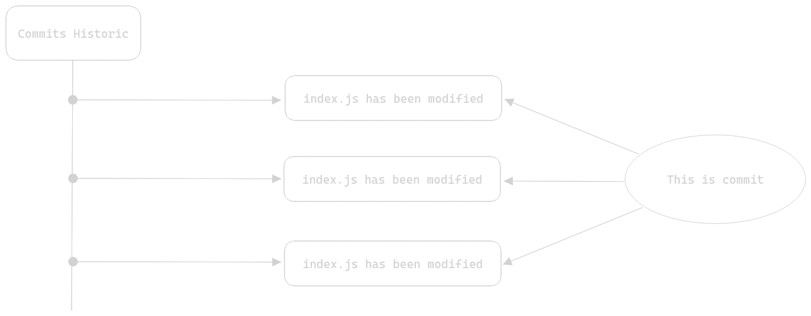
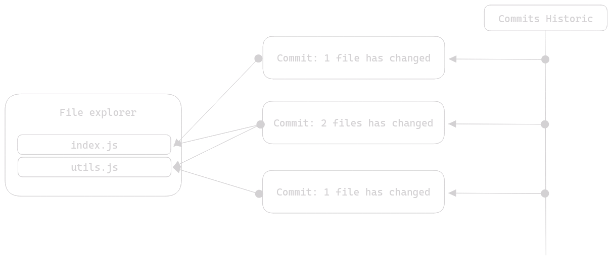
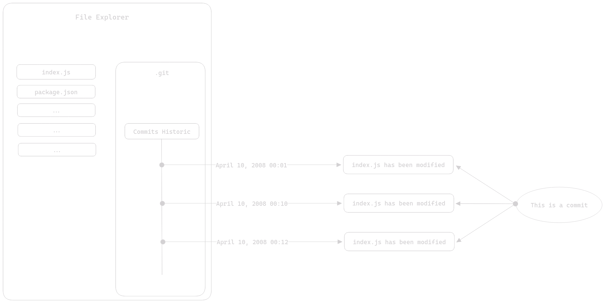
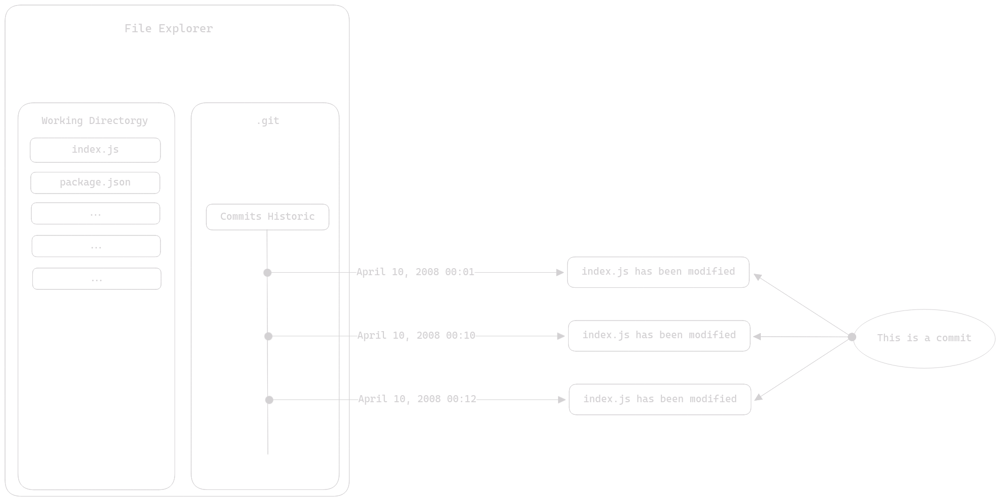
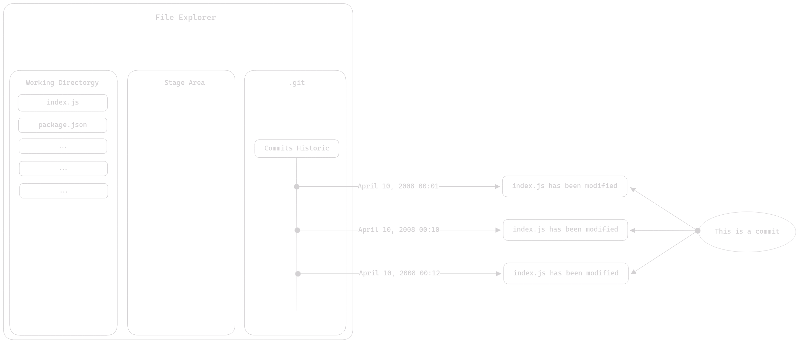

# Table des Matières

- [Table des Matières](#table-des-matières)
- [Fonctionnement de Git](#fonctionnement-de-git)
  - [Terminologie de Git](#terminologie-de-git)
    - [Le Commit](#le-commit)
    - [Le dépôt local](#le-dépôt-local)
    - [Le Working Directory (Repertoire de travail)](#le-working-directory-repertoire-de-travail)
    - [La Stage Area (Zone de préparation)](#la-stage-area-zone-de-préparation)
  - [À quoi ça sert exactement ?](#à-quoi-ça-sert-exactement-)
  - [Comment on s'en sert exactement ?](#comment-on-sen-sert-exactement-)
- [Résumé](#résumé)

# Fonctionnement de Git

## Terminologie de Git

Avant d'aborder le fonctionnement interne de Git, il est nécessaire que vous connaissiez un peu les termes de Git ainsi que les différents mécanismes et concepts qui le régisse.

### Le Commit

Un commit est un point dans l'évolution d'un fichier. Prenons une image pour expliquer cette phrase :



Comme vous pouvez le voir sur ce schéma, les commits sont stockés au sein d'un historique, cet historique permet de tracker l'évolution des fichiers de votre dépôt local (nous aborderons ce terme juste après). Le terme "commit" pourrait se traduire comme validation dans ce contexte. En fait, un commit est effectué de façon manuel par l'utilisateur de Git, nous allons prendre un exemple :

Vous avez développé une fonction qui vous a torturé l'esprit et la dernière chose que vous voulez est d'avoir à la réécrire parce que vous l'auriez perdu ou supprimer sans possibilité de la récupérer. Dans ce cas vous allez interagir avec Git et effectuer un "commit" pour que cette fonction soit gravée dans le marbre et que même si vous veniez à supprimer cette fonction par inadvertence, elle continuerait d'exister quelque part dans une version antérieure de votre fichier (stockée dans votre dépôt local).

En demandant à Git de faire un "commit" (d'effectuer une validation), vous avez en fait dit à Git de créer une nouvelle version de votre fichier. Version dans laquelle votre fonction existe quoi qu'il advienne de votre fichier de code (à une seule exception dont nous parlerons dans la section dédiée au dépôt).

Un commit est donc une validation de modification, à laquelle s'ajoute quelques options. En fait, pour effectuer un commit il y a un impératif, donner un "nom" à ce commit. Enfin on parle de message, ce message va servir à décrire ce que fait votre commit. Si nous reprenons l'exemple du dessus, un message de commit correct serait quelque chose du genre : "Implémentation de ma super fonction très utile". En attribuant un message à votre commit c'est comme si vous annotiez votre modification. De la même manière que vous écrivez des commentaires de code. Sachez qu'un message de commit est obligatoire.

Notez d'ailleurs que plus votre message de commit est descriptif, plus vous vous remercierez lorsque vous chercherez une modification bien particulière et que vous la trouverez grâce à la clareté de vos messages.

Maintenant que nous avons parlé du message du commit, nous allons parler de la façon dont vous allez dire à Git quel fichier vous voulez inclure dans votre commit. Et pour cette partie, nous allons avoir besoin d'un bon vieux schéma :



Les commits peuvent affecter 1 fichier ou un ensemble de fichier. Par exemple (et c'est très généralement recommandé) vous pourriez vouloir qu'un commit affecte un seul et unique fichier, pour des raisons d'atomicité. Si c'est le cas, prennez un cookie et ne changez rien, c'est ce qu'il faut. Mais parfois, vous avez des modifications qu'il serait illogique de scinder dans des commits différents. Dans ce cas, vous pouvez très bien dire à Git de créer 1 commit pour 2 fichiers.

En réalité, qu'un commit affecte un ensemble de fichier n'est pas dramatique du tout, il faut simplement que ça vous parraisse logique de le faire de cette façon, et surtout le plus important, que ça ne devienne pas une contrainte dans le futur. Ce n'est pas le genre de chose qui peuvent être expliquées, seule votre expérience avec Git vous le fera comprendre. Mais sachez qu'une fois que vous aurez compris (en pratique) comment fonctionnent les commits et à quoi ils servent, vous ne pourrez plus vous passer de Git.

Mais étant donné que vous lisez cet article pour en apprendre plus sur Git et plus précisement cette section pour en apprendre plus sur les commits, nous allons quand même essayer de comprendre pourquoi ceux qui ont pris un cookie en ont eu le droit.

Bien, imaginons simplement que :

```
Vous travaillez sur un projet avec Git et vous faites des modifications
mais un peu moins de commit, vous effectuez beaucoup de modifications
tant et si bien qu'au bout d'un moment.. votre programme ne fonctionne plus
du tout. Alors vous en chercher la cause en mettant les mains dans le code.
Mais pas moyen de mettre la main sur la ou les modifications responsables.
Et evidemment, votre dernier commit remonte à il y a deux heures.
Vous n'avez pas d'autres choix que de vous torturez l'esprit et passer en
revue tout ce que vous avez fait depuis deux heures. Ou restaurer la version
de votre code qui supprime toutes les modifications que vous avez effectué
depuis ces deux heures. Vous êtes dans une situation certes peu enviable
mais bien mérité, c'est en faisant des erreurs que l'on apprend, vous n'êtes
pas prêt d'oublier cette leçon et vous résignez à avoir perdu deux heures
de votre vie.
```

En fait, votre erreur à été de ne pas faire de commits au fur et à mesure de votre avancée. Voyez ça comme une aubaine. Vous ne referrez jamais l'erreur de ne pas estimer Git à sa juste valeur. Si vous aviez fait vos commits au fur et à mesure vous auriez pu revenir à une version antérieure, la tester, voir si cela réglait votre souci ou non et restaurer une version fonctionnelle qui n'était pas si loin en arrière dans le temps. On ne parle pas ici de régularité dans le temps (faire un commit tout les x temps) mais plutôt en terme de progression. Pour vous donner une image :

Un puzzle est un ensemble de pièces qui, une fois assemblées forme une image.
Un projet est un ensemble de morceau de code qui, une fois assemblés forme une application.

Vous trouveriez sans doute stupide que lorsque l'on fait un puzzle et que l'on se trompe de pièce, plutôt que de changer la pièce mal placée on défasse entièrement le puzzle. Et bien c'est exactement la même chose avec une application, il serait plus que stupide d'avoir à supprimer l'interface graphique de votre application car le dernier commit ne la contenait pas et que vous avez fait une bourde avec le générateur de particule de votre application. Mais que puisque vous n'avez pas effectué de commit après avoir fini votre interface utilisateur, elle soit à refaire pour X ou Y raison.

En fait, l'idée est qu'il ne faut pas que vos commits fassent trop de chose, un commit ne devrait pas :

- Créer une interface graphique
- Créer un algorithme de génération de mot de passe
- Corriger un bug

En général, il est recommandé de faire un commit pour une modification **significative** et ses modifications connexes par exemple :

Vous devez corriger un bug dans votre algorithme de génération de mot de passe et ajouter une fonctionnalité à cet algorithme.

Il est **acceptable** que ces deux modifications apparaissent dans le même commit, mais il sera toujours mieux de limiter vos commits à une action significative. Par action significative nous entendons : des modifications qui apportent un intérêt à votre code.

Ajouter un commentaire à une ligne de code n'est pas significatif. Commenter une classe complexe l'est. Ajouter une fonctionnalité à votre application est significatif. Corriger un bug l'est aussi. Enfin vous saisissez l'idée.

En fait lorsque vous travaillez avec Git vous pouvez vous demander :

- Est-ce que j'ai envie que ma modification soit indépendante des autres ?
- Est-ce que si je dois revenir à ce commit je vais devoir refaire .. ?
- Est-ce que cette modification mérite vraiment un commit ?

Normalement ça devrait vous aider. Voilà, il semblerait que nous ayons abordé les sujets les plus importants concernant les commits.

### Le dépôt local

Git fonctionne avec ce qu'on appelle des dépôts, en fait un dépôt est assez simple à comprendre dans le principe. Un dépôt est un endroit dans lequel un historique de commits est stocké. En fait, quand nous parlons de dépôt local, vous pourriez traduire par dossier.

Enfin, pour être tout à fait exact, un dépôt local n'est pas un dossier, disons plutôt qu'il est stocké dans un dossier. Avec Git un dépôt local est stocké dans un dossier caché nommé `.git`. La présence de ce dossier à la racine de votre projet fait de ce dernier un projet Git, certains diront que cela fait de votre projet, un dépôt local, ce n'est pas tout à fait vrai, il s'agit d'un raccourci un peu simpliste.

Quoi qu'il en soit, prenons un schéma pour expliquer la façon dont un projet Git est agencé :



Voilà la réalité des choses. Enfin, à peu de choses près. Mais sur ce schéma, nous voyons un peu plus en détail comment Git agence vos projets. En fait, ce schéma démontre que le réel dépôt local est contenu dans le dossier `.git` qui se trouve à la racine de votre projet Git. Voilà pourquoi dire qu'un dépôt Git est le dossier qui contient vos fichiers est un raccourci un peu simpliste (mais surtout incorrect). Dire que le dossier `.git` est le dépôt local est également incorrect (ou plutôt pas tout à fait exact), en fait : L'ensemble des fichiers contenu dans le dossier `.git` forme le dépôt local. Mais nous chipotons, si vous dites que le dossier `.git` est le dépôt local, personne ne vous dira le contraire.

Vous vous souvenez quand nous vous avions dit "Version dans laquelle votre fonction existe quoi qu'il advienne de votre fichier de code (à une seule exception dont nous parlerons dans la section dédiée au dépôt)" ? Et bien, en fait, nous faisions référence au cas où vous supprimeriez votre dépôt local. Puisque c'est dans votre dépôt local qu'est stocké votre historique de commits et donc vos commits. Si vous veniez à supprimer votre dépôt, tous vos commits seraient perdus et donc votre fonction avec. Ça peut paraître évident, mais puisque ce qui paraît évident va mieux en le disant, nous le disons.

Notez d'ailleurs : Nous utilisons le terme "dépôt" mais il est certain que vous serez majoritaierement confronté au terme "repository" abrégé "repo". Le terme repository est simplement la traduction Anglaise de "dépôt".

### Le Working Directory (Repertoire de travail)

Nous entrons la dans le coeur de Git. Le working directory est l'endroit qui contient vos fichiers, cela peut paraitre abstrait, nous allons donc encore une fois prendre un schéma pour comprendre :



En fait, le working directory est l'endroit dans lequel vous allez effectuer vos modifications, d'où son nom "de travail", vous passerez la plupart de votre temps à le manipuler. C'est la raison pour laquelle dire que le dossier de votre projet Git est votre dépôt local est incorrect. C'est votre working directory. Vous passerez plus de temps à effectuer des modifications au sein de votre working directory que dans n'importe quel autre espace Git.

### La Stage Area (Zone de préparation)

La stage area est la seule zone Git qui n'est pas aussi tangible que le working directory ou que le dépôt local. Dans le sens où cette dernière n'inscrit rien dans le mabre, en fait, cette zone Git sert à préparer les modifications que vous effectué à vos fichiers au sein du working directory pour un envoie vers votre dépôt local. Elle sert de zone tampon entre votre working directory et votre dépôt local. Prenons un schéma pour voir où elle se trouve :



Voilà comment on peut représenter la stage area. Elle se situe entre le working directory et le dépôt local, d'où cette appéllation de "zone tampon". Je suis d'accord, ce schéma n'explique pas à quoi elle sert exactement, nous allons y venir. 

Notez que ce schéma à pour vocation d'expliquer basiquement comment Git est agencé mais qu'il est techniquement inexact, nous avons choisi de le représenter comme ça car nous ne cherchons pas à expliquer dans le détail, et que pour une explication sommaire, ce schéma fait l'affaire. Mais nous devons quand même vous notifiez qu'il n'est pas 100% exact par acquit de conscience. En réalité c'est un tout petit peu compliqué que ça. Considérez simplement que nous utilisons un raccourci pour éviter des explications hors contexte et avouons le, barbante pour le commun des mortels.

## À quoi ça sert exactement ?

## Comment on s'en sert exactement ?

# Résumé