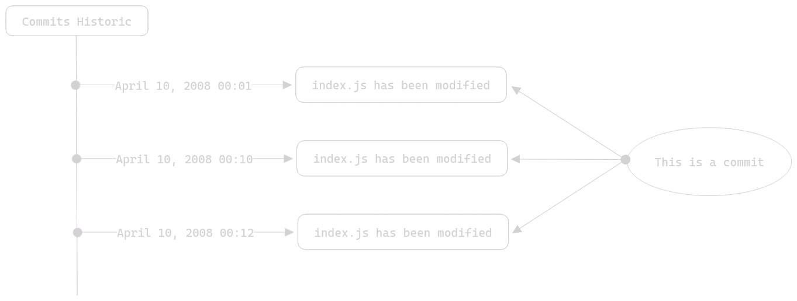

# Table des Matières

- [Table des Matières](#table-des-matières)
- [Fonctionnement de Git](#fonctionnement-de-git)
  - [Terminologie de Git](#terminologie-de-git)
    - [Le Commit](#le-commit)
  - [À quoi ça sert exactement ?](#à-quoi-ça-sert-exactement-)
  - [Comment on s'en sert exactement ?](#comment-on-sen-sert-exactement-)
- [Résumé](#résumé)

# Fonctionnement de Git

## Terminologie de Git

Avant d'aborder le fonctionnement interne de Git, il est nécessaire que vous connaissiez un peu les termes de Git ainsi que les différents mécanismes et concepts qui le régisse.

### Le Commit

Un commit est un point dans l'évolution d'un fichier. Prenons une image pour expliquer cette phrase :

Comme vous pouvez le voir sur ce schéma, les commits sont stockés au sein d'un historique, cet historique permet de tracker l'évolution des fichiers de votre dépôt local (nous aborderons ce terme juste après). Le terme "commit" pourrait se traduire comme validation dans ce contexte. En fait, un commit est effectué de façon manuel par l'utilisateur de Git, nous allons prendre un exemple :

Vous avez développé une fonction qui vous a torturé l'esprit et la dernière chose que vous voulez est d'avoir à la réécrire parce que vous l'auriez perdu ou supprimer sans possibilité de la récupérer. Dans ce cas vous allez interagir avec Git et effectuer un "commit" pour que cette fonction soit gravée dans le marbre et que même si vous veniez à supprimer cette fonction par inadvertence, elle continuerait d'exister quelque part dans une version antérieure de votre fichier (stockée dans votre dépôt local).

En demandant à Git de faire un "commit" (d'effectuer une validation), vous avez en fait dit à Git de créer une nouvelle version de votre fichier. Version dans laquelle votre fonction existe quoi qu'il advienne de votre fichier de code (à une seule exception dont nous parlerons dans la section dédiée au dépôt).

Un commit est donc une validation de modification, à laquelle s'ajoute quelques options. En fait, pour effectuer un commit il y a un impératif, donner un "nom" à ce commit. Enfin on parle de message, ce message va servir à décrire ce que fait votre commit. Si nous reprenons l'exemple du dessus, un message de commit correct serait quelque chose du genre : "Implémentation de ma super fonction très utile". En attribuant un message à votre commit c'est comme si vous annotiez votre modification. De la même manière que vous écrivez des commentaires de code. Sachez qu'un message de commit est obligatoire.

Notez d'ailleurs que plus votre message de commit est descriptif, plus vous vous remercierai lorsque vous chercherez une modification bien particulière et que vous la trouverez gràce à la clareté de vos messages.

Maintenant que nous avons parlé du message du commit, nous allons parler de la façon dont vous allez dire à Git quel fichier vous voulez inclure dans votre commit. Et pour cette partie, nous allons avoir besoin d'un bon vieux schéma :

Les commits peuvent affecter 1 fichier ou un ensemble de fichier. Par exemple (et c'est très généralement recommandé) vous pourriez vouloir qu'un commit affecte un seul et unique fichier, pour des raisons d'atomicité. Si c'est le cas, prennez un cookie et ne changez rien, c'est ce qu'il faut. Mais parfois, vous avez des modifications qu'il serait illogique de scinder dans des commits différents. Dans ce cas, vous pouvez très bien dire à Git de créer 1 commit pour 2 fichiers.

## À quoi ça sert exactement ?

## Comment on s'en sert exactement ?

# Résumé