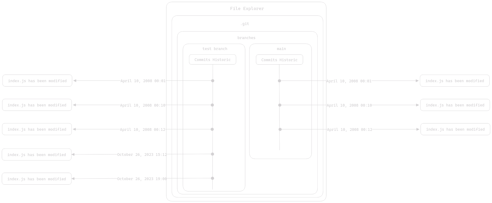

# Table Of Contents

- [Table Of Contents](#table-of-contents)
- [Branches](#branches)
  - [What Branches Are](#what-branches-are)
  - [Merge](#merge)
  - [Conclusion](#conclusion)
- [Summary](#summary)

# Branches

Branches are a mechanism that allows duplicating the commit history into multiple versions. They are very useful in collaborative work. Their basic use is to separate the changes made by one developer (Developer A) from those made by another developer (Developer B). This way, developers don't interfere with each other's work.

Branches have more than one purpose, and we will explore some additional uses of branches in a forthcoming article.

## What Branches Are

Let's revisit a diagram to visualize:

This is what your repository looks like. In reality, you are already using a branch called "main," which represents the primary branch. So you make your changes on the "main" branch, and you have a single commit history.

Let's see what would happen if we created a new branch:

We duplicated the commit history, and now there are two branches. This is very useful to allow developers to work independently. Let's see what happens when we work on this new branch.

Two commits have been added to the history of the new branch. The usefulness of doing this may seem abstract, but you'll fully grasp the benefits of branches when we delve into collaborative work with Git.

## Merge

There's a feature that gives branches more substance: the merge. With merge, you can combine two histories. You tell Git to take one commit history and add the commits it contains to another history. In the case where we're working on two separate branches, this is the result of a merge:

Here, we've merged the commit history of the "*test branch*" into "*main*". That's what a merge is all about. You'll notice that the branch from which we merged the history continues to exist; a merge doesn't involve deleting the branch.

## Conclusion

We will delve into more concrete use cases later. This article was meant to provide a brief overview of branches and one use case for them.

# Summary

- Branches are a mechanism duplicating commit history.
- Branches can be merged to "import" commits from another history; this operation is called a "merge."