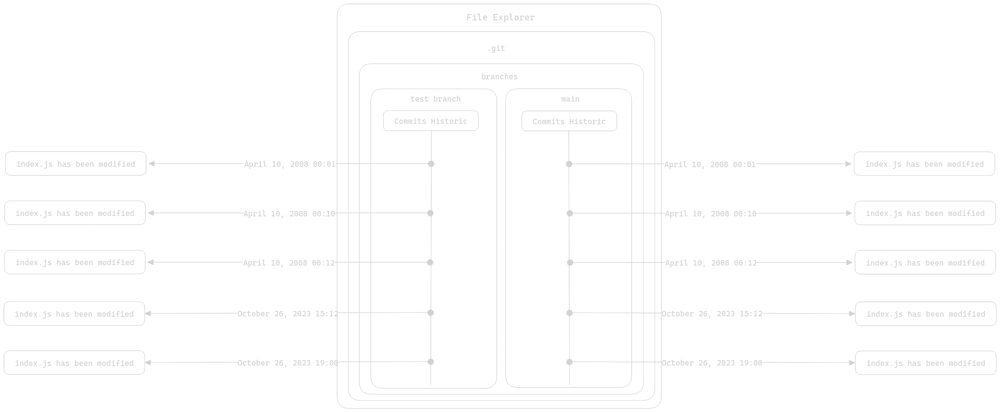

# Table des Matières

- [Table des Matières](#table-des-matières)
- [Les branches](#les-branches)
  - [Ce que sont les branches](#ce-que-sont-les-branches)
  - [Le merge (La fusion)](#le-merge-la-fusion)
- [Conclusion](#conclusion)

# Les branches

Les branches sont un mécanisme qui permet de dupliquer l'historique de commits en plusieurs versions. Elles sont très utile dans des travaux collaboratifs. Leur utilisation de base est de séparer les modifications d'un développeur A de celles d'un développeur B. De cette façon, les développeurs ne se marchent pas dessus lors de leur travail.

Ce n'est pas la seule utilité des branches, nous verrons quelques utilisations tierces des branches dans un prochain article.

## Ce que sont les branches

Nous allons reprendre un schéma afin de visualiser :

Voilà à quoi votre dépôt ressemble, dans les faits, vous utilisez déjà une branche, nommée "main" qui signifie "principale". Donc vous effectuez vos modifications sur une branche nommée "main", vous avez donc un unique historique.

Voyons voir ce qu'il se passe si nous créeions une nouvelle branche :

Nous avons dupliqué l'historique de commit, ce qui fait qu'il en existe maintenant deux, c'est très utile pour permettre aux développeur de développer tranquillement. Voyons ce qu'il se passe si nous travaillons sur cette nouvelle branche.

Deux commits ont étés ajoutés à l'historique de la nouvelle branche, l'utilité de faire ça peu paraître abstraite, vous saisirez pleinement l'utilité des branches lorsque nous aborderons les travaux collaboritif avec Git.

## Le merge (La fusion)

Il existe une fonctionnalité qui donne de la matière aux branches; le merge. Grâce au merge il est possible de fusionner 2 historiques ensemble, on dit à Git de prendre un historique de commits et d'ajouter les commits qu'il contient au sein d'un autre historique. Dans le cas où nous travaillons sur deux branches séparée, voici le résultat qu'un merge donnerait : 

Ici, nous avons fusionné l'historique de commit de la branch "*test branch*" dans la "*main*". Voilà en quoi consiste un merge. Vous noterez que la branche depuis laquelle nous avons fusionné l'historique continue d'exister, une fusion n'implique pas la suppresssion de la branche.

# Conclusion

Nous aborderons des cas d'utilisations plus concret un peu plus tard, cet article avait simplement pour but de présenter sommairement les branches ainsi qu'un cas d'utilisation de ces dernières.