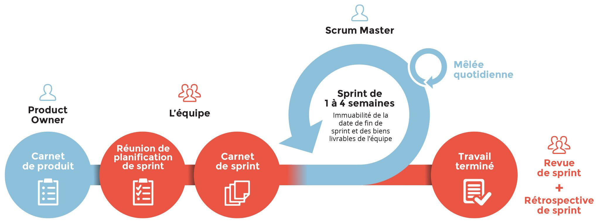
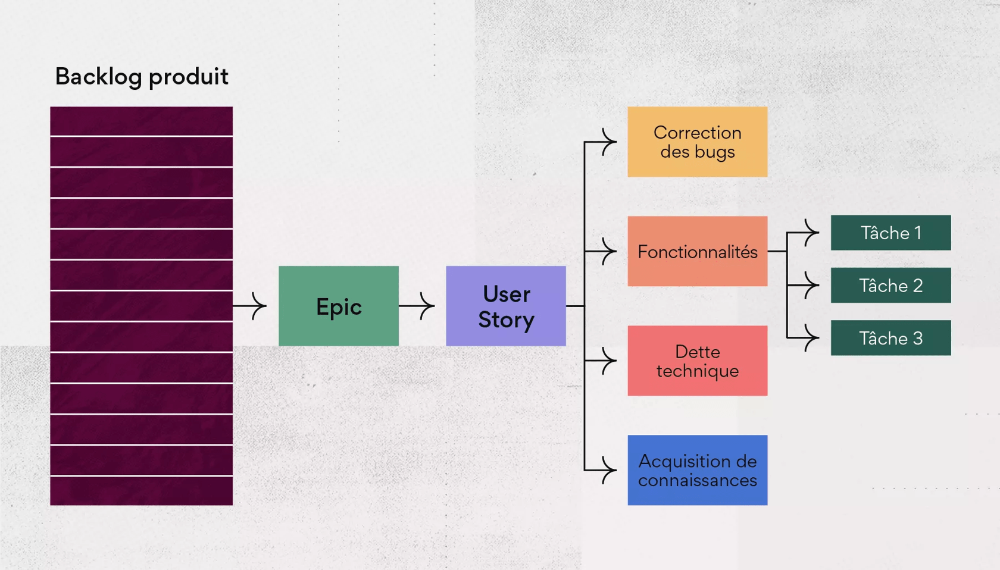
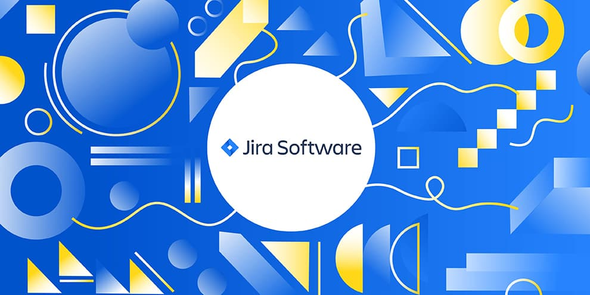
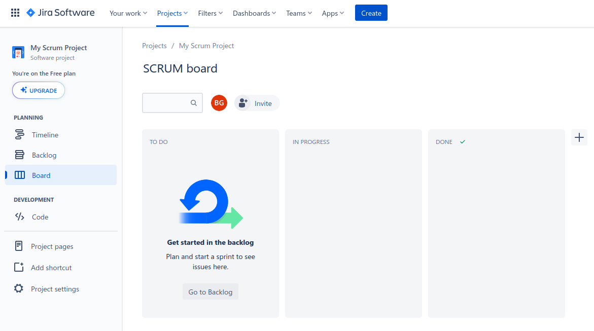
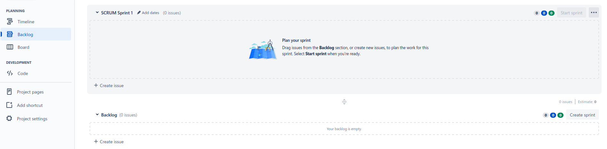
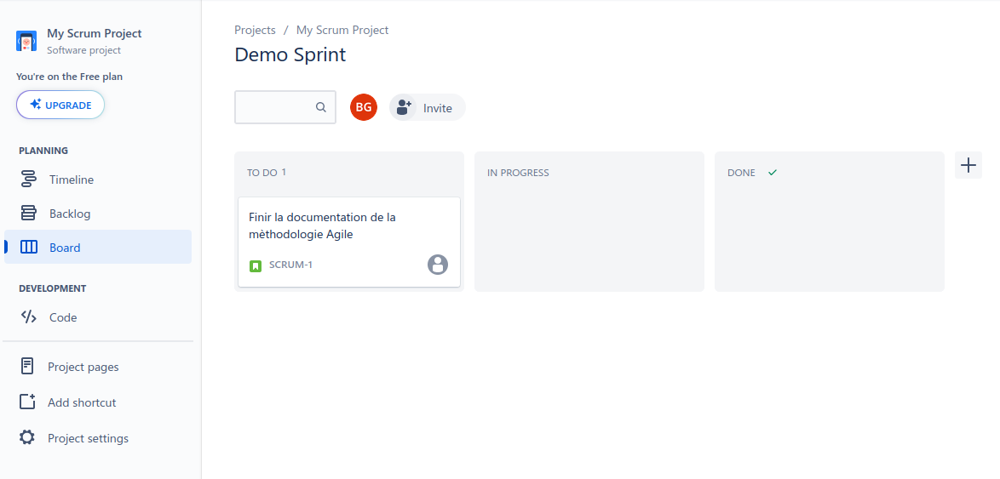

# Table of Contents

- [Table of Contents](#table-of-contents)
- [Agile Manifest and Project Management](#agile-manifest-and-project-management)
- [Agile Manifesto and Project Management](#agile-manifesto-and-project-management)
- [The 4 Values of the Agile Method](#the-4-values-of-the-agile-method)
  - [Fundamental Principles of the Agile Method](#fundamental-principles-of-the-agile-method)
    - [Productivity](#productivity)
    - [Customer Communication](#customer-communication)
    - [Communication](#communication)
- [SCRUM](#scrum)
  - [Roles](#roles)
    - [Product Owner](#product-owner)
    - [Scrum Master](#scrum-master)
    - [Development Team](#development-team)
  - [The Product Backlog](#the-product-backlog)
  - [The Sprint Backlog](#the-sprint-backlog)
  - [Rituals / Ceremonies](#rituals--ceremonies)
    - [Sprint Planning](#sprint-planning)
    - [Daily Meeting](#daily-meeting)
    - [Sprint Review](#sprint-review)
    - [Sprint Retrospective](#sprint-retrospective)
- [Organizational Tools](#organizational-tools)
  - [Jira](#jira)
    - [Introduction](#introduction)

# Agile Manifest and Project Management

Managing a project following the Agile manifesto places the **customer** at the center of the project's life cycle. By including the customer in the project setup process, the Agile team can adjust the project's development based on the evolving customer needs over time.

# Agile Manifesto and Project Management

Managing a project following the Agile manifesto places the **customer** at the center of the project's life cycle. By including the customer in the project setup process, the Agile team can adjust the project's development based on the evolving customer needs over time.

# The 4 Values of the Agile Method

- Team: **Individuals** and **interactions** over **processes** and **tools**.
- Application: **Operational features** over **comprehensive documentation**.
- Collaboration: **Collaboration with customers** over **contractual negotiation**.
- Adaptation: **Adaptability** to change over **following a rigid plan**.

## Fundamental Principles of the Agile Method

### Productivity

- Regularly deliver functional solutions.
- **Prioritize important tasks**.
- Segment project production.
- Maintain a strict guideline during project development.
- Embrace simplicity and the art of maximizing the amount of work **not done**.

### Customer Communication

- **The customer is part of the team**.
- Maintain **continuous communication** with the customer.
- Establish a **trustworthy relationship** with the customer.

### Communication

- Team adaptation and improvement.
- Prioritize human contact.
- **Human contact facilitates understanding of different stakeholder constraints**.
- Verbal and non-verbal communication (face-to-face communication).
- Self-responsibility of team members.

# SCRUM

SCRUM is a **framework** for implementing the Agile methodology **incrementally** and **iteratively**.

## Roles

### Product Owner

The **Product Owner** (PO) plays a critical role with a significant workload. They are responsible for **communication** between the **customer** and the **team**. The PO **organizes** the **Product Backlog** based on **task prioritization** and generally oversees the project's lifecycle.

### Scrum Master

The **SCRUM Master** is responsible for ensuring that the **SCRUM framework** is correctly implemented and is also in charge of **facilitating Agile rituals**.

### Development Team

The development team consists of **developers** who are responsible for **building project features**.

## The Product Backlog

The **Product Backlog** is a **registry** from which the team selects **tasks to be completed**. The Product Backlog is filled by the **Product Owner** and may contain :

- **User Stories**: User stories are **simple tasks** explaining a product feature. User stories can be broken down into **sub-tasks** that serve as **steps toward completing the related user story**. User stories are formatted as "**As a..., I can..., so that...**" or "**As a..., I must..., so that...**." For example, "As a learner, I must log in to participate in my class." This way, developers know what they need to do for the feature. User stories answer **`Who ? What ? Why ?`**, and it's up to the **developer** to answer **`How ?`**.

- **Epics**: Epics are a **group of user stories**. Generally, epics represent a complete feature, whereas **user stories** represent **fragment of feature**. An epic might be `User Authentication` and could contain the user story in the example above.

## The Sprint Backlog

The **Sprint Backlog** is a **registry** containing **tasks to be performed** to deliver a feature. Once a sprint is completed, the team gathers for **Agile retrospective rituals** to identify different **improvement areas** and define new tasks for the next sprint.

In the SCRUM framework, there are two types of **backlogs**:

- The **product backlog**
- The **sprint backlog**

## Rituals / Ceremonies

### Sprint Planning

**Sprint Planning** is a **SCRUM ritual** that brings together the **Product Owner** and the **development team** to **plan the upcoming sprint**. Together, they create a task list to place in the **Sprint Backlog**, based on **task priority** or the **previous iteration**. At the end of Sprint Planning, the development team knows which tasks need to be completed in the next sprint.

### Daily Meeting

The **Daily Meeting** is a ritual primarily led by the development team and, as the name suggests, it occurs **daily**, generally before starting work on the project (also known as a **Stand-Up Meeting**). This ritual should not exceed **15 minutes** for efficiency.

During this ritual, team members answer the following questions:

- **What did I do yesterday ?**
- **What obstacles did I encounter ?**
- **What will I do today ?**

If a significant issue is raised, it should be addressed in a separate **meeting to resolve it**.

### Sprint Review

The **Sprint Review** is the only ritual that **includes project stakeholders**. This ritual brings together:

- The customer
- The SCRUM Master
- The Product Owner
- The development team

The review typically lasts **1 hour per week of the sprint**, meaning that if a sprint lasts 2 weeks, the review will take 2 hours.

This ritual is used for the team to present the **project's progress** to all stakeholders. This way, the customer can express their impressions about the project and suggest any necessary adjustments. With this ritual, all stakeholders ensure that the project is moving in the right direction.

Moreover, it may happen that, at the end of a sprint, the **Product Owner cancels this ritual** for some reasons, including when the sprint encountered difficulties in being completed and is, therefore, **not presentable**.

### Sprint Retrospective

The **Sprint Retrospective** is a ritual used by the development team to **identify what happened during the last sprint**. This ritual brings together:

- The SCRUM Master
- The development team

The purpose of this ritual is not to highlight what didn't work but to **highlight what went well** and the **areas for improvement that the SCRUM Master can guide the team towards** to correct what went wrong. This ritual can last up to **4 hours** due to its nature.

# Organizational Tools

## Jira

Jira is a collaborative service that allows the application of the Agile methodology through its design. It can be used with the SCRUM framework and KANBAN (although it was not designed for this purpose). If you need to work in Agile methodology using the SCRUM framework, Jira is by far the best candidate and is, for all intents and purposes, mandatory in any respectable industry-related organization.

### Introduction

Jira is an online service that provides a range of user-friendly tools accessible through a clean and ergonomic interface.

While it may seem complex at first, it is a highly comprehensive tool that will save you a lot of time in project management.

Let's take a look at the basic Jira interface:

This is the interface that developers typically encounter. Note that this interface is specific to a SCRUM project; it is different for a Kanban project.

Here is the interface used during **Sprint Planning**:

This interface represents the **Product Backlog** and is used to transfer tasks to the **Sprint Backlog**. This way, the team takes the priority tasks and moves them into the Sprint space. Once the Sprint begins, tasks are automatically transferred to the **Board**.

Here is what the **Board** looks like when a **Sprint** starts:

It resembles a Kanban board.

At the end of the sprint (the end date can be defined when creating the sprint), tasks not completed are returned to the **Product Backlog**.

Jira is not much more complicated than this for developers. It is important to note that this document serves as an introduction, and for the sake of completeness, it only covers basic aspects. Jira is extremely comprehensive and goes beyond what has been presented here.