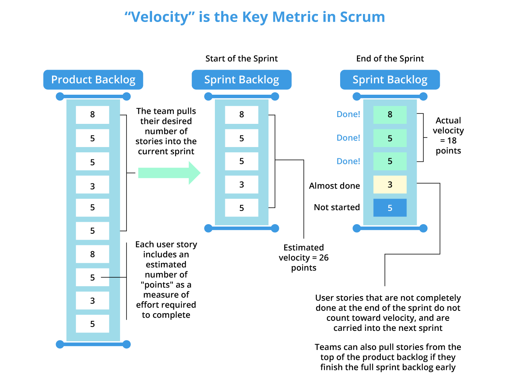
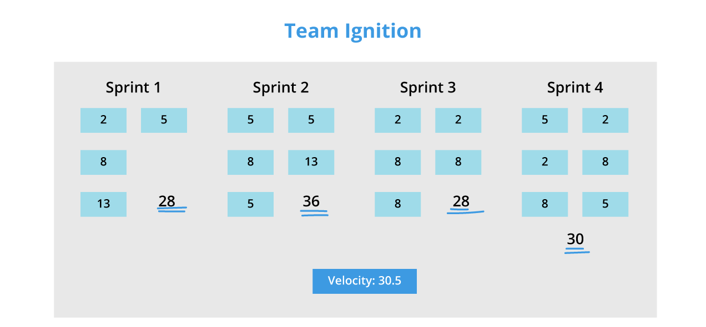
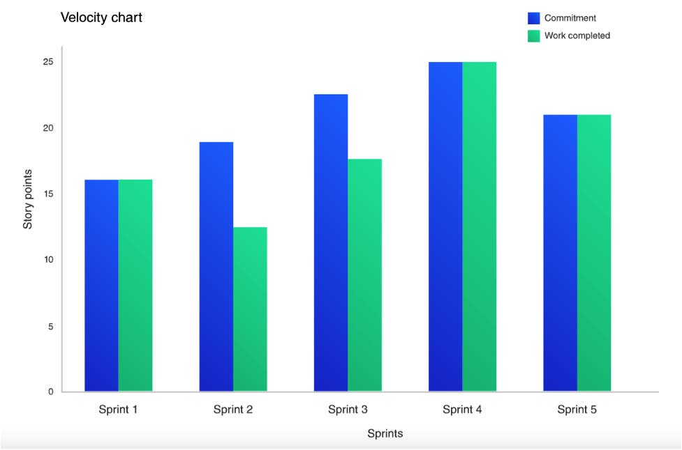

# Table of Contents

- [Table of Contents](#table-of-contents)
- [What is Velocity in the SCRUM Method?](#what-is-velocity-in-the-scrum-method)
- [Who Is Responsible for Estimating PBIs?](#who-is-responsible-for-estimating-pbis)
- [How to Use Average Velocity in Agile Development?](#how-to-use-average-velocity-in-agile-development)
- [Agile Velocity Chart](#agile-velocity-chart)
- [What Are the Benefits of Measuring Velocity?](#what-are-the-benefits-of-measuring-velocity)
- [What Are the Drawbacks?](#what-are-the-drawbacks)
- [Conclusion](#conclusion)

# What is Velocity in the SCRUM Method?

**Velocity** is an indicator used in projects managed using an agile method, for instance with the **SCRUM** framework. Agile velocity helps determine the effort an agile development team can provide for completing tasks scheduled within a sprint. It is expressed in terms of points.

The **Product Owner** places a certain number of features or items to be realized during the sprint in the **Product Backlog**, generally formalized as *user stories*. The development team assigns a certain number of points to each **Product Backlog Item (PBI)**. These points represent both the complexity and the estimated duration of completing the PBI empirically. It is not a linear scale; the Fibonacci suit is often used.

The values that can be assigned include:

- *1* for an extremely simple task, such as fixing a label, for example.
- *2, 3, 5* for a slightly more complex task, such as creating a simple input form.
- *8, 13, 21, 34, 55, 89, 144* if there is insufficient information to estimate the task correctly.

# Who Is Responsible for Estimating PBIs?

The **Product Owner** is responsible for providing the features or items to be completed during the sprint in the *Product Backlog*. During the planning session, the team must consider its capacity to determine the average velocity.

Only the development team is capable of estimating **PBIs**. They are responsible for distributing points empirically to each **PBI**. Once defined, velocity will be used to validate or revise the development plan.

It should be noted that the velocity in future iterations will be more or less equal to the previous one. For example, if *stories A* and *B* (each estimated at *2 points*) are 100% complete, and the output *C* (*3 points*) is only 80% complete, the iteration's velocity will be *4 points*.

Velocity can also be calculated by considering *story points*. *Story points* represent *user stories* and are a unit of measurement that indicates the effort required to complete a task. Generally, each organization has its method for assigning values to *story points*.

The velocity of a specific sprint is calculated by multiplying the number of completed *user stories* in the sprint by the *story points* assigned to each user story. For example: If you have completed *4 user stories*, and you assigned *3 story points* to each story, the total velocity for the sprint will be *4x3 = 12*.

You can average individual sprint velocities to obtain the average sprint velocity.

# How to Use Average Velocity in Agile Development?

**Agile** is synonymous with iterative development, rapid solutions, and rapid product market entry. To achieve this, Agile teams must know how much work they can do in a sprint and how long it will take to complete the project or deliver a functional version to the client. Velocity helps them make this decision and work efficiently.

Average velocity is calculated once the project has progressed through three or four sprints (iterations). Average velocity is calculated by averaging the story points accumulated in each sprint. Based on this calculated average velocity, teams can rely on the amount of remaining work.

Using the example above of the average velocity of a sprint, you can assume that the team can complete work at a rate of *12 story points* per sprint. So, if you have *120 story points* left to complete in your project, you can estimate that you'll need *10 more sprints* to finish the project.

While it's accurate, it's subject to fluctuations depending on changing requirements, team size, and project complexity.

# Agile Velocity Chart

The **Agile method** offers various tools to visually represent data points. These tools provide an easy indicator of project progress, and if cloud-based, they can be accessed by all project stakeholders.

Agile velocity charts are essentially graphs, with *story points* displayed on the horizontal or vertical axis, and completed sprints shown on the opposite axis. They are an excellent way to make your project's velocity accessible to everyone. Cloud-based charts can be accessed by teams and stakeholders.

A velocity chart is a great way to track project progress, see if the project is progressing consistently and predictably, and identify patterns in the team's sprint velocity. If your charts show many irregular peaks and troughs, you might conclude that your project is unpredictable, as velocity isn't consistent.

# What Are the Benefits of Measuring Velocity?

- **Essential for Release Planning**:
  Velocity is crucial for release planning as it helps the Product Owner determine how many sprints are needed to create a product with the desired features. By estimating the number of necessary sprints, the Product Owner can estimate the release date.

- **Feedback for the Team**:
  Velocity is an excellent metric for measuring the team's progress. By tracking velocity over time, teams can measure whether the changes they make during the sprint improve or reduce productivity. While velocity can fluctuate in new teams, experienced teams have a consistent velocity and can measure their progress through velocity charts.

- **Forecasting**:
  Velocity helps the team identify how many user stories they can complete in a sprint. Predictability is an important factor that helps teams make decisions about project timelines and budgets. Forecasting is usually done by taking the average velocity of the last three sprints.

# What Are the Drawbacks?

Measuring progress based on velocity:

While velocity is an excellent metric for measuring the team's progress, it's important to remember that it's an empirical measure, which means it can be used for estimation but not as the final standard for measuring the team's progress.

Velocity is often based on *story points*, which are subjective to the team. Teams may have their own values for *story points* for user stories and, therefore, define their velocity and scope of work. Velocity is thus a variable that should not be used as an **absolute** criterion for measuring the team's progress.

- **Startup Issues**:
  Velocity is better estimated by mature and well-established Scrum teams. New or transitioning teams and teams embarking on new projects will need time to become well-oiled machines and achieve accurate velocity.

- **Significant Tasks**:
  Scrum/Agile works on the principle of breaking large projects into smaller pieces and delivering a shippable product at the end of each piece. A Scrum project is typically broken down into Epics, sprints, user stories, and tasks. If Epics are not sufficiently comprehensive, it will directly affect velocity, and teams may
  see a significant drop in velocity from one sprint to another, making velocity less reliable.

- **Downtime Is Not Accounted For**:
  A sprint is not limited to delivery or production. Many things happen between the two, such as email exchanges, stand-up meetings, etc. If these elements are not considered in the sprint duration, velocity may weaken.

# Conclusion

Velocity is an important measure used by Scrum Masters and Product Owners to track their team's progress and ensure project success. Agile's fast response, rapid delivery, incremental, and iterative framework ensures rapid releases, quality products, and customer satisfaction.

Velocity helps determine project timelines and allows product owners to provide accurate estimates without falling into the overcommitment trap.