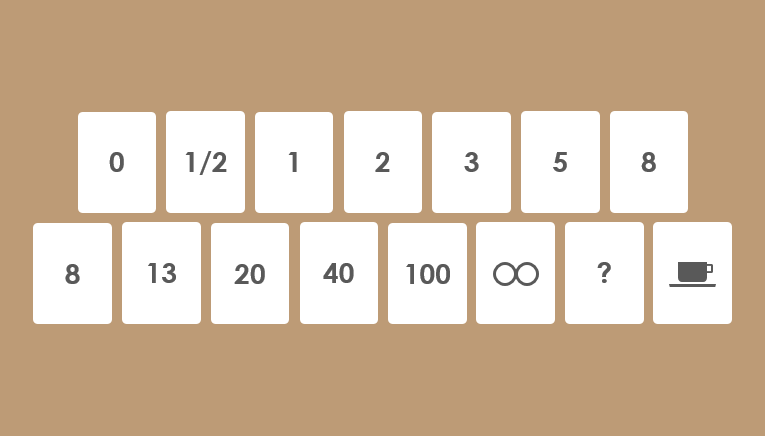
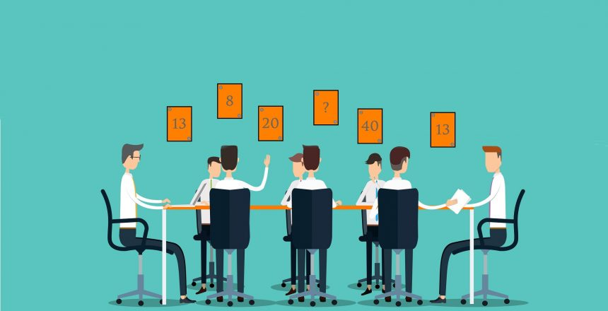
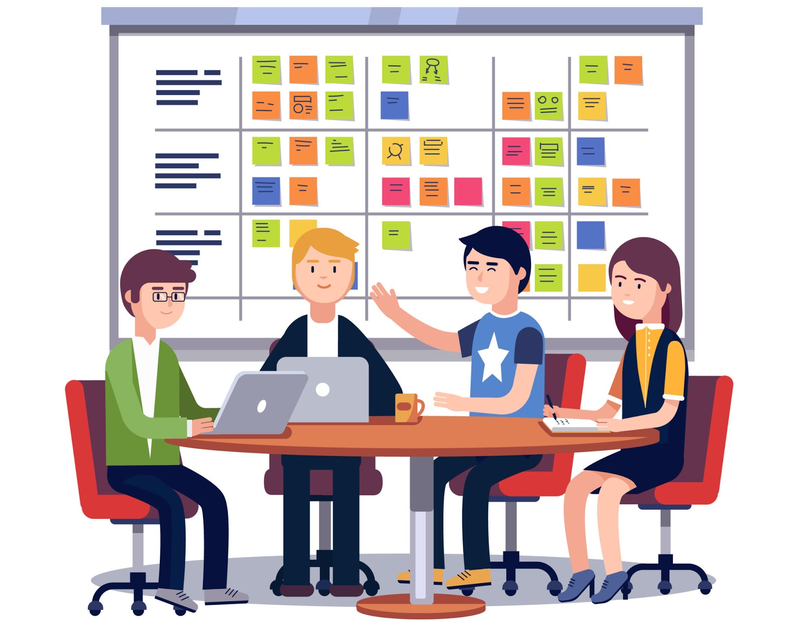

# Table Of Contents

- [Table Of Contents](#table-of-contents)
- [What is Planning Poker](#what-is-planning-poker)
- [How Planning Poker works](#how-planning-poker-works)
- [Benefits](#benefits)
- [Who include to Planning Poker meeting](#who-include-to-planning-poker-meeting)
- [When to organize Planning Poker meeting](#when-to-organize-planning-poker-meeting)

# What is Planning Poker

**The Agile method of planning poker consists to an difficulty estimation of tasks founded on a consensus**

The **Planning Poker**, also known as "**SCRUM Poker**" or "pointing poker", is a playful method that **development teams** uses for project management tasks.
These **estimations** are **based** on a **consensus** from whole team, which make it most accurate than other methods. 
To help to evaluate story points count for relevant tasks, **teams** uses planification **poker cards**.

The *Fibonacci suit* is used for evalutations.
Like we search to **quantify the effort**, the message is clear : *biggest the scenario is*, **less evaluations will be accurates**.
The cards pack used for Planning Poker *must contains* following values : 1, 2, 3, 5, 8, 13, 21, 34, 55, 89, 144.
Some simplify larges values turning them into 20, 40, 100... because the idea is "be globally good" instead of "be accurately wrong".
We generaly add 0 and 1/2 values.

# How Planning Poker works

At the beginning of a Planning Poker session, the **Product Owner** or **the client** reviews an agile user story and reads it **aloud**. A user story is a general and informal explanation of a software feature that describes how it will deliver value to the end user (i.e., the client).

1. **Distribute cards to participants**

   Distribute an identical set of cards to each participant. Each card has a number agreed upon by the team. Each player should have a set of cards with different numbers. Mike Cohn recommends a sequence of 0, 1, 2, 3, 5, 8, 13, 20, 40, and 100 in his book "***Agile estimating and planning***."

   Other common sequences include doubling the next number (e.g., 1, 2, 4, 8, etc.). *These values can represent a variety of things*: the number of story points, ideal days, or other units the team uses for estimation.

   The card sets intentionally have a **minimal level** with significant jumps in numbers. This ensures that for each story, everyone can reach a consensus number. *If there were a card for every number from 1 to 50*, **the process would be terribly slow**.

2. **Read the story aloud**

   The moderator (**Product Owner**) tells the story to the group. If participants have questions, the moderator answers them.

3. **Discuss the story**

   After the group has finished listening to the story, *each person shares their perspective* on it. Some of the discussion points will likely include questions like:

   - How should we approach the work?
   - How many people are expected to be involved?
   - What skills will be needed to work on the story?
   - How to address obstacles that hinder progress?

   The group will also try to learn more about the story and ask questions to better understand it.

4. **Select and reveal**

   After the discussion, each person privately chooses a card from the deck. Typically, it's used to show an estimation of the story's points (but it can also represent the number of ideal days). Once everyone has chosen a card, **they reveal them simultaneously**.

   If a player shows a higher card, it means the **story** will be **completed** with more **difficulty** and more **time committed**. Keep in mind that it's common for estimates to vary significantly.

5. **Achieve consensus**

   When team members show the same card, that number becomes a consensus. At that point, the group can proceed and work on the next story. However, if the cards continue to vary, further discussions about the story will follow.

   Participants whose estimates are higher or lower than others will communicate their perspective. They will then attempt to explain to their teammates the reasons for the divergence. Once this additional deliberation is complete, everyone will review their cards and reveal them again.

   If a participant still agrees with their last choice, they repeat the card or potentially choose a new one. Generally, estimates start to converge after the second round. If that's not the case, the process is repeated until the team agrees on a single number.

# Benefits

According to a study, *estimates from Planning Poker* are **statistically higher** than **individual estimates**.

- Other benefits include the following:

  - Estimating tasks relative to each other. It is *often challenging to gauge the time needed for a project*, especially when it's the first time. Planning Poker allows teams to become familiar with their assessments. After playing the game for some time, *you will eventually build a set of tasks that serve as future reference for comparison*.

  - **Giving equal voice to all team members**. It can encourage new employees to speak up by playing a card and explaining their logic. For instance, imagine you are building a food reservation app. You and your colleague might provide a smaller estimate, like 10 or 15. On the other hand, a new employee might give an estimate of 100. Perhaps they have experience from creating a similar app in their previous job and know that such an app takes a lot of time, especially in comparison to others.

  - Identifying gaps in requirements and implementation. When participants disclose their estimates, they have to support them by explaining why they are high or low. This can trigger questions about requirements and implementation – a feedback loop that helps detect gaps.

# Who include to Planning Poker meeting

The right people need to join the meeting, otherwise, it becomes difficult to reap the benefits described above. These crucial roles are as follows:

- Scrum Team Members: Scrum team members provide the items for the Product Backlog – a list of items to be delivered (e.g., new features). They also contribute to discussions on story points.

- Scrum Master: The Scrum Master is the facilitator of agile meetings. They should participate in all (or nearly all) meetings.

- Product Owner: The Product Owner will describe all user stories to the team and answer their questions.

# When to organize Planning Poker meeting

In general, teams organize a session **after creating the initial backlog**. While sessions can sometimes take **more than one day**, they help in establishing **useful initial estimates** for project sizing or scoping.

Items are added to the Product Backlog **incrementally throughout the project's lifespan**. That's why it's typically more practical for teams to conduct sessions *once per iteration*. In most cases, this happens a few days after the end of the iteration. Likewise, it also occurs just after a daily standup (a type of agile meeting) because the whole team is present.