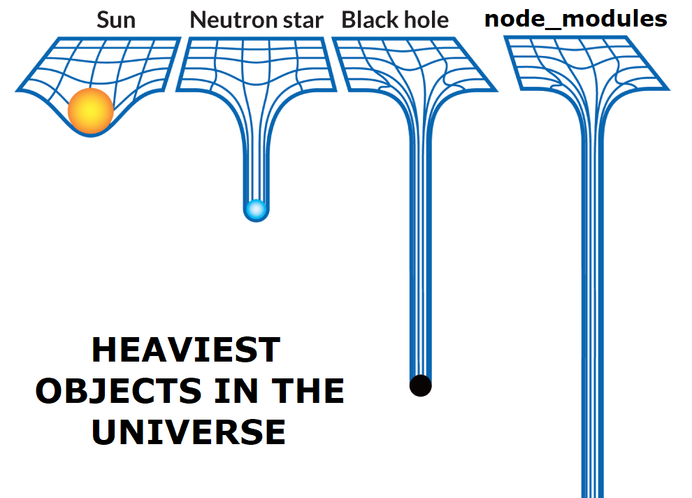

# Sommaire

- [Sommaire](#sommaire)
- [Qu'est ce que Npm (Node Package Manager)](#quest-ce-que-npm-node-package-manager)
  - [Qu'est ce qu'Npx (Node Package Executer)](#quest-ce-qunpx-node-package-executer)
- [Node Packages (Paquets Node)](#node-packages-paquets-node)
- [Node Modules](#node-modules)
- [Le fichier **package.json**](#le-fichier-packagejson)
- [Semantic Versioning ou le Versionnage sémantique](#semantic-versioning-ou-le-versionnage-sémantique)
- [Difference entre `dependencies` et `devDependencies`](#difference-entre-dependencies-et-devdependencies)
- [Le fichier package-lock.json](#le-fichier-package-lockjson)
- [Commandes](#commandes)
  - [Initialiser un projet Npm](#initialiser-un-projet-npm)
  - [Installer des dépendances (modules)](#installer-des-dépendances-modules)
    - [Dépendances de production](#dépendances-de-production)
    - [Dépendances de développement](#dépendances-de-développement)
    - [Réinstaller des dépendances](#réinstaller-des-dépendances)
- [Sources](#sources)


# Qu'est ce que Npm (Node Package Manager)

Npm est un **manager de paquet Node** utilisé pour importer ou publier des paquets Node avec les autres developpeurs qui utilisent Npm.

Npm se divise en 3 grands axes :

1. **Le site Npm**

    Le site [Npm](https://www.npmjs.com/) sert à connaitre les paquets Node disponibles sur le Registry Npm.

2. **CLI ou l’Interface en Ligne de Commande**

    La CLI est une énorme partie du Npm puisque c'est par la **CLI** que vous **interagissez avec Npm** et avec le Registry Npm afin d'**importer des paquets** s'y trouvant ou de **publier vos paquets**.

1. **Npm Registry ou le Dépôt**

    Le **Registry Npm** est en fait une énorme **base de données** qui va contenir des **applications prêtes à l'emploi**, ou simplement des **paquets Node** que vous pourrez **télécharger** afin de les utiliser ou les **adapter** à vos besoins pour les utiliser **dans votre paquet**.

## Qu'est ce qu'Npx (Node Package Executer)

Npx est en fait un exécuteur des paquets Node.
Grâce à Npx il est possible d'exécuter des packages Node depuis le registry plutôt que de le télécharger pour pouvoir l'exécuter, cette approche est intéressante dans le cadre où vous voudriez utiliser une application Node, vous n'auriez alors pas besoin de télécharger quoi que ce soit pour pouvoir utiliser l'application.

Notez qu'en général, cette approche est préférée pour des applications légères.

# Node Packages (Paquets Node)

Un package Node est un fichier ou un dossier décrit par un fichier **package.json** (Le plus souvent un dossier).

Le fichier **package.json** va donner des informations à propos de votre package, c'est pourquoi il faut que ce fichier contienne les informations les plus détaillées possible.

Un package node peut être public ou privé, [En savoir plus sur la visibilité des packages](https://docs.npmjs.com/about-private-packages), comme il peut être restreint à une certaine portée ou non. [En savoir plus sur la portée des packages](https://docs.npmjs.com/about-scopes) 

Un package node peut être tout ce qui suit (Et plus encore) :

1. Un fichier ou un dossier décrit par un fichier **package.json**
2. Un fichier compressé contenant (1.)
3. Une URL pointant vers 2.
4. L'url d'un repos GitHub qui lorsque cloné donnera un fichier ou un dossier décrit par un fichier **package.json**

# Node Modules

Les modules Node sont des dépendances dont votre package aura besoin pour s'exécuter ou simplement qui vous seront nécessaire pour le développement de votre package.

Un module Node peut être :

- Un dossier
- Un fichier JS

Vous pouvez voir les modules Node dans le dossier `node_modules`.

Note : Il se peut qu'un module Node ne se soit pas correctement installé, dans ce cas, il est conseillé de supprimer le dossier `node_modules` et de réinstaller tous les modules.

Puis-ce qu'une image vaut mieux que mille mots :



Cette image explique à quel point les modules Node sont lourds.

Note : Il est très important de ne pas omettre le `node_modules` dans votre .gitignore afin de ne pas envoyer tous les modules sur votre dêpot distant.

# Le fichier **package.json**

Comme expliqué plus haut, le fichier **package.json** est un fichier qui est essentiel à votre package Node.

Ce fichier fait office de carte pour votre package, vous aller renseignez beaucoup d'informations dans ce fichier.
Vous pourrez y mettre toutes les informations qui suivent (Et bien plus encore, liste non exhaustive) :

```json
- "name" : Le nom de votre package
- "version" : La version de votre package
- "description" : La description de votre package
- "keywords" : Ce champ est plutôt optionnel, cependant, si vous voulez partager votre package, il pourrait se révéler indispensable
- "homepage" : Il peut s'agir d'un dépôt GitHub ou simplement un site, il s'agit simplement de la page de référence liée à votre package
- "bugs" : Ce champ permet de renseigner où remonter les bugs liés à votre package
- "author" : Quelques informations à propos de vous
- "main" : Permet de définir le point d’entrée de votre package (Habituellement index.js)
- "scripts" : Permet une configuration avancée pour votre package [En savoir plus sur les valeurs possibles de script](https://docs.npmjs.com/cli/v8/using-npm/scripts)
- "dependencies" : Ce champ permet de renseigner une liste de dépendances dont votre package aura besoin afin de s’exécuter correctement, le format de ses entrées est le suivant : `"express":"4.18.3"` permettra de définir que votre package nécessitera express en version `4.18.3`
- "devDependencies" : Ce champ permet de renseigner une liste de dépendances necessaires au développement de votre package
- "private" : Renseigner ce champ permet de s'assurer que votre package ne sera pas publié. Il s'agit d'un booléen
```

Npm se chargera de générer des valeurs par défaut à des champs non renseignés, par exemple pour le champ `script`.
Npm initialisera le champ avec une valeur de test.

# Semantic Versioning ou le Versionnage sémantique

Le versionnage sémantique est un standard que vous devriez suivre lors de modifications significatives de votre package.

Il est recommandé de publier vos modifications avec différentes versions de votre package, champ `version` de votre **package.json**.
De ce fait, les autres développeurs utilisant votre package pourront comprendre l'étendue des modifications apportées pour chaque version de votre package.
Pour aborder ce qui suit, vous devez comprendre quelques termes :

1. MAJOR : On appellera MAJOR une version qui ne sera pas rétrocompatible
2. MINOR : On appellera MINOR une version qui modifiera votre code (Ajout d'une fonctionnalité par exemple) mais qui restera rétrocompatible
3. PATCH : On appellera PATCH une version qui aura pour effet direct de corriger des bugs, tout en restant rétrocompatible

Recommandation : [Apprenez en plus sur les spécificités du Semantic Versioning](https://semver.org/)

Voici les spécificités globales du versionnage sémantique : 

- Il est recommandé de commencer le développement de votre package en version `1.0.0`
- Lorsque vous voudrez faire une mise à jour PATCH, votre package passera en version `1.0.1`
- Lorsque vous voudrez faire une mise à jour MINOR, votre package passera en version `1.1.0` comme vous pouvez le constater, le nombre de patch a été remis à 0.
- Lorsque vous voudrez faire une mise à jour MAJOR, votre package passera en version `2.0.0` comme vous pouvez le constater, le nombre de minor a été remis à 0.

Il est important de comprendre que lorsque vous sortez une mise à jour MAJOR, elle influe sur les MINOR ainsi que sur les versions PATCH.
Que lorsque vous sortez une mise à jour MINOR, elle influe sur les versions PATCH.

Note : Chaque chiffre n'est pas limité à 9, une version telle que `2.3.19` est une version totalement correcte.

Afin d'appronfondir sur le sujet, vous pouvez [cliquer ici](https://docs.npmjs.com/about-semantic-versioning#using-semantic-versioning-to-specify-update-types-your-package-can-accept)

# Difference entre `dependencies` et `devDependencies`

Le champ `dependencies` vous permettra de lister les dépendances dont votre package aura besoin pour s'exécuter.
Le champ `devDependencies` quant à lui vous permettra de lister les dépendances dont vous aurez besoin afin de développer votre package.

Si vous voulez cuisiner un gâteau par exemple et le manger :

Pour la préparation de votre gâteau, vous pourrez utiliser un batteur électrique ou simplement utiliser une fourchette.
Dans cet exemple, le batteur électrique représente une devDependencies, utile, mais optionnel puis-ce qu'il vous est possible d'utiliser une fourchette.

Et la fourchette représente elle, à la fois une devDependencies ainsi qu’une dépendance puisque vous pourrez utiliser cette même fourchette pour manger votre gâteau.

# Le fichier package-lock.json

Le fichier **package-lock.json**  est automatiquement généré par Npm lorsqu’une opération affectant l'arborescence du dossier `node_modules` ou le fichier `package.json` est effectuée.
Le **package-lock.json** va contenir une description exacte de l'arborescence des dépendances.
Ce fichier est prévu pour être inclus au dêpôt, il peut être utilisé pour :

- Obtenir une seule définition de l'arborescence des dépendances, de cette façon tous les aspects de l'intégration continue sont assurés d'installer les mêmes dépendances.
- Obtenir un moyen simple de retracer les états du `node_modules`
- Obtenir une meilleure visibilité des changements apportés à l'arborescence
- Optimiser l'installation des dépendances, afin de ne pas avoir à re-télécharger les dépendances déjà installées.

Le format du fichier **package-lock.json** ressemble fortement à celui du **package.json**, [En apprendre plus sur le format du **package-lock.json**](https://docs.npmjs.com/cli/v8/configuring-npm/package-lock-json)

# Commandes

Il existe une flopée de commandes pour interagir avec Npm, vous trouverez dans la suivante section certaines commandes qui pourraient s'avérer utile.

## Initialiser un projet Npm

Si vous voulez initialiser un projet Node.Js vous devez utiliser la commande :

```sh
npm init
```

Cette commande doit être exécutée dans le dossier racine de votre projet, et sert à créer le fichier **package.json** qui servira (entre autres) à Npm de savoir qu'il s'agit d'un projet Node.Js.

## Installer des dépendances (modules)

### Dépendances de production

Vous serez sans doute amener à importer des dépendances dans vos projets, vous devrez donc utiliser :

```sh
npm install <nom_du_package>
```

Exemple pour utiliser la librairie Express dans votre projet :

```sh
npm i express
```

Note : Que vous utilisiez `install` ou `i`, le résultat sera le même.

Cette commande aura pour effet de télécharger les fichiers d'Express dans le dossier `node_modules` (dossier qui sera créer automatiquement à la racine de votre projet s'il n'existe pas).

### Dépendances de développement

Il est possible que vous ayez besoin de dependances uniquement pour le cycle de développement de votre projet dans ce cas il est utile de savoir comment définir le type de dépendances, si vous souhaitez importer des dépendances uniquement pour le développement, utilisez cette commande :

```sh
npm install <nom_du_package> --save-dev
```

Exemple concret :

```sh
npm install Winston --save-dev
```

Cette commande téléchargera `Winston` dans votre `node_modules` et le répertoriera dans la section `devDependencies` de votre `package.json`.

### Réinstaller des dépendances

Dans le cas où vous voudriez importer un projet Node.Js sans `node_modules` ou que vous viendriez à perdre votre dossier, vous pourriez avoir besoin de réimporter les dépedances du projet, pour ça, vous pouvez utiliser la commande :

```sh
npm install
```

Ce qui aura pour effet de télécharger toutes les dépendances connues du projet (Npm se base sur les sections `dependencies` et `devDependencies` de votre `package.json`).

Note : Vous pouvez utiliser la commande `npm install --dev` afin de télécharger uniquement les dépendances de développement.

# Sources

Disclaimer : Les sources ci-dessous sont exclusivement en anglais.

- [Qu'est ce que Npm](https://www.w3schools.com/whatis/whatis_npm.asp)
- [Introduction à NPX](https://www.geeksforgeeks.org/what-are-the-differences-between-npm-and-npx/)
- [Module Node & Paquet Node](https://docs.npmjs.com/about-packages-and-modules)
- [Le fichier **package.json**](https://docs.npmjs.com/cli/v8/configuring-npm/package-json)
- [Le versionnage sémantique avec Node](https://docs.npmjs.com/about-semantic-versioning)
- [Le versionnage sémantique](https://semver.org/)
- [La différence entre les champs `dependencies` et `devDependencies`](https://stackoverflow.com/questions/18875674/whats-the-difference-between-dependencies-devdependencies-and-peerdependencies)
- [Le fichier **package-lock.json**](https://docs.npmjs.com/cli/v8/configuring-npm/package-lock-json)