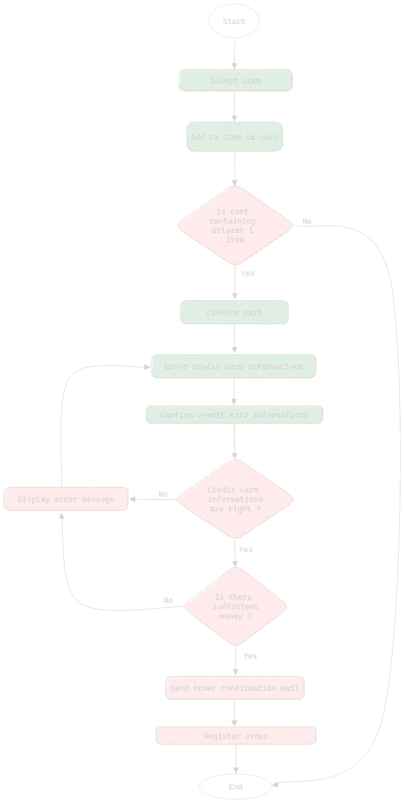

# Table Of Contents

- [Table Of Contents](#table-of-contents)
- [Introduction](#introduction)
- [Benefits](#benefits)
- [Methods](#methods)
  - [Feature Design](#feature-design)
    - [Pseudocode](#pseudocode)
  - [UML (Unified Modeling Language)](#uml-unified-modeling-language)
  - [Merise (Method of Study and Computer Realization for Enterprise Systems)](#merise-method-of-study-and-computer-realization-for-enterprise-systems)
- [Summary](#summary)

# Introduction

Application design is a broad subject that encompasses various aspects and stages that occur before the functional implementation of the project. Design comes in various forms, spanning multiple realizations that highlight different aspects of a project.

Throughout your application, keep in mind that **the design of a project is not set in stone and is subject to evolution** for various reasons. Perhaps a feature no longer aligns with the client's needs, or you may not have anticipated certain technical constraints. Don't be discouraged if you realize that your design requires some adjustments; this is perfectly normal.

Pro Tips: If you need to make changes due to a technical constraint encountered during the project implementation stage, try, if possible (unless you're working on a tightly scheduled corporate project, for example), to revisit the part of your design that needs adjustments rather than postponing it. It's more advantageous to pause your implementation to engage in reflective work to resolve the encountered issue, rather than having to rework your code and redesign it later.

I've personally experienced both approaches (retro-design and design), and it's much more rewarding to pause your coding session to adjust your design and then continue coding with the new design version. It's better than trying to develop your feature by trial and error and then redo your design while trying to match the behavior of your code.

Keep this in mind, even if it may seem abstract as a concept at the moment.

# Benefits

Design allows development team members to describe the behavior of an application before they begin development. This is highly valuable for several reasons (among others):

- Defining behavior with an overview of the implementation to be produced
- Having a clear understanding of each aspect of the implementation
- Presenting various aspects of the application to all project stakeholders
  - Obtaining feedback on the design to ensure that the features meet the stakeholders' expectations
- Facilitating the transfer of application specifications to each new development team member

These are the benefits of designing a project. Note that these are primarily group benefits. However, design also allows the approach to a project to be completely different. It raises the right questions before even starting the project, which can save a significant amount of time and energy in the long run.

By designing an application, you will become a much better developer.

# Methods

There are several ways to design an application or a feature, and you'll discover some of them in this section.

## Feature Design

There are various ways to design features, and one of them is the **flowchart** coupled with **pseudocode**. This design method is typically used for beginner developers. It helps instill algorithmic logic in developers and enables a clear breakdown of a feature.

Note that this method is not widely used on a large scale because it's relatively time-consuming and quite rudimentary. We include it here for the sake of completeness, although it's unlikely you'll be asked for this kind of design.



This is what a flowchart looks like; it's merely a schematic representation of an algorithm.

In the example above, squares represent actions, circles have semantic value to denote the start and end of a flowchart, and triangles are used to represent conditions.

A color code has been added to separate actions. Typically, a flowchart is used to represent system actions. Here, green actions represent user actions, while red ones are system actions.

### Pseudocode

Pseudocode is code written not in a programming language but in human language, such as English, for example. Note: It's preferable to write your resources in English to adhere to an unwritten rule aiming to ensure that anyone can understand the content (similar to writing your code comments in English, for example).

In essence, pseudocode can be seen as a textual representation of a flowchart. Here is an example, using the previous flowchart as a reference:

```pseudo-code
Start of the procedure;
The user selects an item;
The user adds the item to the cart;
If the number of items in the cart is >= 1:
  The user confirms the cart;
  The user enters their banking information (Bank_ASK);
  The user confirms their banking information;
  If the banking information is correct:
    If the account balance associated with the user's entered banking information is >= the cart price:
      The system sends a confirmation email to the user's account email;
      The system records the user's order.
    Else:
      The system displays an error message;
      Return to Bank_ASK;  
  Else: 
    The system displays an error message;
    Return to Bank_ASK;  
Else:
  End of the procedure.
End of the procedure.
```

You might want a more verbose example:


*<p style="text-align:center;">Pseudo-code to left and to right code in programming language.</p>*

Note: The conditions could have been inverted to avoid creating as many levels of nesting. It was done this way only to follow the flowchart precisely and demonstrate the two approaches as faithfully as possible. In general, try to avoid more than two levels of nesting.

## UML (Unified Modeling Language)

**UML is a LANGUAGE**—even though it may seem counterintuitive, UML is indeed a language. UML allows the schematic modeling of various aspects of an application or system through various types of diagrams.

We will discuss this further in the article: [UML Basics (not available)](not-available.md)

## Merise (Method of Study and Computer Realization for Enterprise Systems)

**Merise (pronounced "Mer-eeze") is a method** used for the structural and organizational study of enterprises (often both at the same time).

However, for an application designer, the Merise method doesn't serve this purpose. In general, when you encounter Merise in this context, it involves creating diagrams or resources related to **relational database systems (SQL)**. While it's technically possible to use Merise for **non-relational databases (NoSQL)**, it's akin to cooking your food with a nuclear reactor. Technically, it works, but it's best to refrain.

Note that Merise is a European method, so if you work on projects outside the European Union, your team members will likely use UML or SysML for databases.

While Merise is a smaller topic than UML, it also deserves a dedicated article: [Database Design Basics with Merise (not available)](not-available.md)

# Summary

- Being an application designer makes you a better developer.
- Application design allows developers to outline their reasoning using schematic representations (diagrams) to gain an overview of a project.
- Design allows non-technical individuals to understand a project's objectives and how to achieve them.
- A strong design enables any developer to understand the code structure.
- **The design of a project is not set in stone and is subject to evolution**; no one can predict everything.
- There are different methods for design, and these methods depend on several factors.