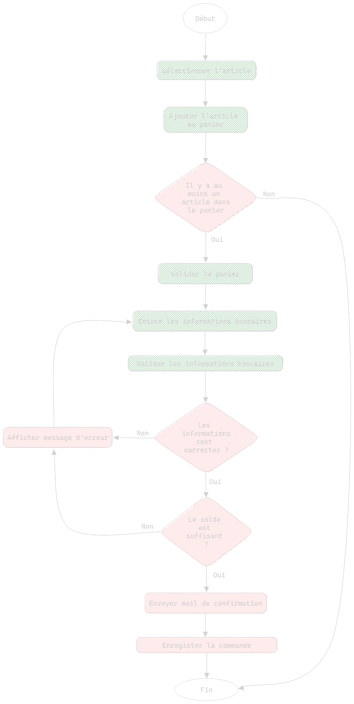
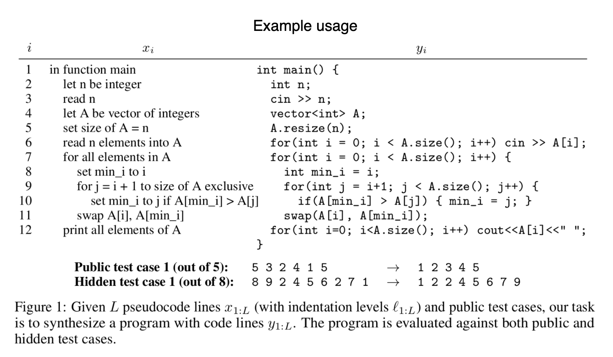

# Table des Matières

- [Table des Matières](#table-des-matières)
- [Introduction](#introduction)
- [Bénéfices](#bénéfices)
- [Méthodes](#méthodes)
  - [Conception de fonctionnalité](#conception-de-fonctionnalité)
    - [Pseudo Code](#pseudo-code)
  - [UML (Unified Modeling Language)](#uml-unified-modeling-language)
  - [Merise (Méthode d'Étude et de Réalisation Informatique pour les Systèmes d'Entreprise)](#merise-méthode-détude-et-de-réalisation-informatique-pour-les-systèmes-dentreprise)
- [Résumé](#résumé)

# Introduction

La conception d'application est un sujet très vaste. Elle regroupe divers aspects ou étapes qui surviennent avant la réalisation fonctionnelle du projet. La conception ne prend pas qu'une forme, elle se décline en une multitude de réalisation qui permettent de mettre en lumière les différents aspects d'un projet.

Tout au long de votre application, veillez à garder à l'esprit que **la conception d'un projet n'est pas immuble et est amenée à evoluer**, pour certaines raisons, peut-être qu'une fonctionnalité ne correspond plus aux besoins du client, peut-être n'aviez-vous pas prévu certaines contraintes techniques. Ne vous formalisez pas si vous vous rendez compte que votre conception nécessite quelques ajustements, c'est parfaitement normal.

Pro Tips : Si vous devez vous réformer suite à une contrainte technique rencontrée pendant l'étape de réalisation de votre projet, essayez dans la mesure du possible (si vous n'êtes pas dans un projet d'entreprise avec des délais serrés par exemple) de revoir la portion de votre conception qui nécessite des ajustements plutôt que de remettre ça à plus tard. Il est plus intéressant de mettre en pause votre réalisation afin de poser votre esprit sur un travail de réflexion pour résoudre le problème rencontré, plutôt que d'avoir à revoir votre code et d'en refaire la conception.

J'ai, à titre personnel expérimenté les 2 approches (la rétro-conception et la conception) et il est de loin plus intéressant de suspendre votre session de code pour ajuster votre conception et de reprendre votre code avec la nouvelle version de conception, plutôt que d'essayer de développer votre fonctionnalité de tête et de refaire votre conception en essayant de retrouver le comportement de votre code.

Gardez ça à l'esprit bien que cela puisse vous semblez abstrait comme concept à l'heure actuelle.

# Bénéfices

La conception permet aux membres d'une équipe de développement de décrire le comportement d'une application avant de commencer à développer, ce qui est très intéressant pour plusieurs raisons (Entre autres) :

- Définir un comportement en ayant une vue d'ensemble sur la réalisation à produire
- Avoir une vision claire sur chacun des aspects de la réalisation
- Présenter les différents aspects de l'application à toutes les parties prenantes du projet
  - Obtenir des retours sur la conception afin de s'assurer que les fonctionnalités sont celles attendues par les parties prenantes
- Permettre une transmission des spécifications de l'application à chaque nouveau membre de l'équipe de développement

Voilà pour les bénéfices de concevoir un projet, notez d'ailleurs qu'il ne s'agit là que de bénéfices de groupe, mais la conception permet aussi d'aborder le développement d'un projet de façon complétement différente. Et de se poser les bonnes questions avant même de commencer à réaliser le projet, ce qui sur le long terme peut faire économiser énormément de temps et d'énergie.

En concevant une application, vous deviendrez un bien meilleur développeur.

# Méthodes

Il existe plusieurs façons de concevoir une application ou une fonctionnalité, vous en découvrirez quelques-unes dans cette section.

## Conception de fonctionnalité

Il y a plusieurs façons de concevoir des fonctionnalités, une d'entre elle est l'**algorigramme** couplé au **pseudo-code**.
Cette méthode de conception est généralement utilisée pour les **développeurs** débutants, elle permet d'inculquer une logique algorithmique aux **développeurs**, en plus de permettre un découpage clair d'une fonctionnalité.

Notez que cette méthode n'est vraiment pas répandue à grande échelle car elle est relativement chronophage et assez rudimentaire, nous la présentons ici par acquit de conscience, bien qu'il est peu probable qu'on vous demande ce genre de conception.



Voilà ce qu'est un algorigramme, il s'agit seulement d'une représentation schématique d'un algorithme.

Dans l'exemple ci-dessus, les carrés représente des actions. Les ronds ont une valeur sémantique pour dénoter le début et la fin d'un algorigramme. Les triangles quant à eux servent à représenter des conditions.

Un code couleur a été ajouté afin de séparer les actions, notez qu'en général, un algorigramme est utilisé pour représenter les actions du système. Ici, les actions dénotées en vert sont les actions utilisateur, alors que celles en rouge sont celles du système.

### Pseudo Code

Le pseudo code est un code qui n'en pas écrit dans un langage de programmation, mais dans une langue humaine. En français par exemple.

Note : Préferez rédiger vos ressources en Anglais afin d'être sûr de pouvoir rejoindre des équipes internationnales (Comme écrire vos commentaire de code en anglais par exemple).

En fait, le pseudo code peut être vu comme une représentation textuel d'un algorigramme, en voici un exemple en reprenant le précédent algorigramme :

```pseudo-code
Début de la procédure;
L'utilisateur sélectionne un article;
L'utilisateur ajoute son article au panier;
Si le nombre d'article dans le panier >= 1 :
  L'utilisateur valide le panier;
  L'utilisateur entre ses informations bancaire (Bank_ASK);
  L'utilisateur valide ses informations bancaire;
  Si les informations bancaires sont correctes :
    Si le solde du compte correspondant aux informations bancaires entrées par l'utilisateur est >= au prix du panier:
      Le système envoie un mail de confirmation à l'adresse mail associé au compte de l'utilisateur;
      Le système enregistre la commande de l'utilisateur.
    Sinon:
      Le système affiche un message d'erreur;
      Retourner à Bank_ASK;  
  Sinon: 
    Le système affiche un message d'erreur;
    Retourner à Bank_ASK;  
Sinon :
  Fin de la procédure.
Fin de la procédure.
```

Vous voudrez sans doute un exemple plus verbeux :



*<p style="text-align:center;">À gauche, le pseudo-code et à droite le code en langage de programmation.</p>*

Note: Les conditions auraient pu être inversé afin de ne pas créer autant de niveau d'imbrication, il s'agissait seulement de suivre l'algorigramme à la lettre afin de démontrer les 2 approches aussi fidèlement, en général, évitez au maximum plus de 2 niveaux d'imbrication.

## UML (Unified Modeling Language)

**UML est un LANGAGE**, bien que cela puisse sembler contre-intuitif, UML est bel et bien un langage.

UML est un langage qui permet de modéliser schématiquement les différents aspects d'une application ou d'un système par le biais de divers types diagrammes.

Nous en parlerons plus tard dans l'article : [Les bases d'UML](not-available.md)

## Merise (Méthode d'Étude et de Réalisation Informatique pour les Systèmes d'Entreprise)

**Merise (prononcé Meurise) est une méthode** permettant d'étudier les entreprises de façon structurelle ou organisationnelle (souvent les 2 à la fois).

Cependant pour un concepteur d'application, la méthode Merise n'a pas cette vocation, en général, lorsque vous serez confronté à Merise dans ce domaine, il s'agira de réalisation de diagrammes / de ressources relatives aux systèmes de **Base de données relationnelle (SQL)**. Bien qu'il est techniquement possible d'utiliser Merise pour des **Base de données non-relationnelle (NoSQL)** mais cela reviendrait à faire cuire votre nouriture avec un réacteur nucléair. Techniquement ça fonctionne, pour autant, il est préférable de s'abstenir.

Notez d'ailleurs que Merise est une méthode européene, inutile donc de vous dire que si vous travaillez sur des projets en dehors de l'union européene, les membres de votre équipe utiliseront sans doute UML ou SysML pour les bases de données.

Merise étant certes un moins gros sujet qu'UML, elle mérite elle aussi un article dedié : [Les bases de la conception de Base de Données avec Merise](not-available.md)

# Résumé

- Être concepteur d'application, c'est devenir un meilleur développeur.
- La conception d'application permet aux développeurs de poser leur raisonnement dans des schémas (appelés diagrammes) afin d'obtenir une vue d'ensemble d'un projet.
- La conception permet à des personnes non techniques de comprendre les objectifs d'un projet et la façon de les atteindre.
- **La conception d'un projet n'est pas immuable et est amenée à évoluer**, personne ne peut tout prévoir.
- Il existe différentes méthodes pour faire de la conception, ces métodes dépendent de plusieurs facteurs.