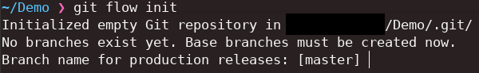
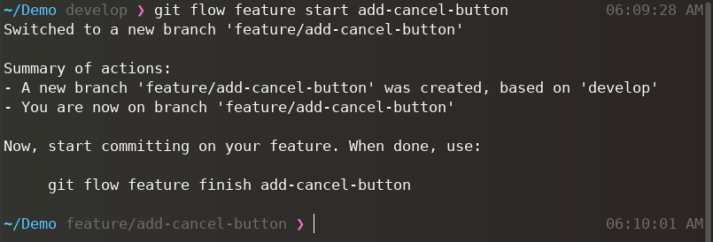

# Table des matières

- [Table des matières](#table-des-matières)
- [Introduction](#introduction)
- [Installation](#installation)
  - [Windows](#windows)
  - [Mac](#mac)
  - [Linux](#linux)
    - [Apt](#apt)
    - [Pacman](#pacman)
- [Prise en main](#prise-en-main)
  - [Initialisation](#initialisation)
  - [Branches Features](#branches-features)
    - [Création](#création)
    - [Terminaison](#terminaison)
  - [Branches Correctives](#branches-correctives)
    - [Création](#création-1)
    - [Terminaison](#terminaison-1)

# Introduction

GitFlow est un **workflow** (flux de travail) qui permet travailler d'une façon à séparer le travail réalisé sur des branches bien distinctes.

En adoptant GitFlow, il est possible de travailler de façon optimale sur un projet afin de bien identifié à quel étape d'un projet nous nous trouvons. 
Ainsi que d'identifier et d'indiquer clairement sur quel type de tâche nous travaillons.

Bien que GitFlow ne soit rien de plus qu'une manière de travailler avec Git sur un projet, un programme a été développé afin de mettre en place GitFlow de manière optimale.

# Installation

## Windows

Sous Windows, Git comporte déjà le module GitFlow, donc si vous avez déjà installé Git, vous possédez déjà GitFlow, si vous n'avez pas encore installé Git, [Téléchargez-le](https://git-scm.com/download/win)

## Mac 

Pour installer GitFlow sous Mac avec HomeBrew :

```sh
brew install git-flow
```

## Linux

### Apt

Pour installer GitFlow sous Linux avec Apt :

```sh
sudo apt-get install git-flow
```

### Pacman

Pour installer GitFlow sous Linux avec Pacman :

```sh
sudo pacman -S git-flow
```

# Prise en main

## Initialisation

Afin d'initialiser GitFlow il vous suffit d'entrer la commande :

```sh
git flow init
```

Dans un dossier qui peut déjà être un dépôt Git, ou non.



Il est recommandé de nommer la branche de principale `main`.

Puis pour tout le reste, il n'appartient qu'à vous de décider du nom des branches, bien qu'en pratique, les noms par défaut soit gardés.

## Branches Features

Les branches Features sont des branches qui seront utiles afin de développer de nouvelles fonctionnalités à votre projet, bien qu'elles ne soient rien d'autres que des branches, elles permettent d'indiquer sémantiquement que les modifications apportées au sein de ces branches seront des modifications concernant l'ajout d'une fonctionnalités.

### Création

Pour créer une branche de type `Feature` rien de plus simple, exécutez simplement la commande :

```sh
git flow feature start <nom_de_la_branche>
```



**Commandes correspondantes sans GitFlow**

```sh
git checkout develop
git branch -b feature/add-cancel-button
```

### Terminaison

Lorsque votre travail est terminé, vous voulez que ce dernier soit ajouté à la branche `develop` dans ce cas, la procédure à suivre est simple.

```sh
git flow feature finish <nom_de_la_branche>
git pull origin develop
```

En faisant ça, vous allez merge votre travail sur la branche `develop` et récupérer celui qui a été produit en parallèle.

**Commandes correspondantes sans GitFlow**

```sh
git checkout develop
git merge feature/add-cancel-button
git branch -D feature/add-cancel-button
```

## Branches Correctives

Les branches correctives (`hotfix`) ont elles aussi une utilité sémantique, elles servent à apporter des corrections à une ou plusieurs fonctionalités ou système au sein de votre projet.

### Création

Pour créer une branche `hotfix` c'est simple, il suffit d'exécuter la commande :

```sh
git flow hotfix start <nom_de_la_branch>
```

Cette commande aura pour effet de créer une branche du type `hotfix`.

**Commandes correspondantes sans GitFlow**

```sh
git branch -b hotfix/fix-cancel-button
git checkout hotfix/fix-cancel-button
```

### Terminaison

Lorsque votre travail est terminé, vous n'avez plus qu'à fermer votre branch en exécutant la commande :

```sh
git flow hotfix finish <nom_de_la_branche>
```

**Commandes correspondantes sans GitFlow**

```sh
git checkout develop
git merge hotfix/fix-cancel-button
git branch -D hotfix/fix-cancel-button
```