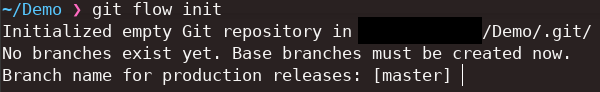

# Table des matières

- [Table des matières](#table-des-matières)
- [Introduction](#introduction)
  - [Installation](#installation)
    - [Windows](#windows)
    - [Mac](#mac)
    - [Linux](#linux)
      - [Apt](#apt)
      - [Pacman](#pacman)
  - [Prise en main](#prise-en-main)
    - [Initialisation](#initialisation)
    - [Branches Features](#branches-features)
      - [Création](#création)
      - [Terminaison](#terminaison)
    - [Branches Correctives](#branches-correctives)
      - [Création](#création-1)
      - [Terminaison](#terminaison-1)
    - [Branches Releases / Livraison](#branches-releases--livraison)
      - [Création](#création-2)
      - [Terminaison](#terminaison-2)
- [Références](#références)

# Introduction

GitFlow est un **workflow** (flux de travail) qui permet travailler d'une façon à séparer le travail réalisé sur des branches bien distinctes.

En adoptant GitFlow, il est possible de travailler de façon optimale sur un projet afin de bien identifié à quel étape d'un projet nous nous trouvons. 
Ainsi que d'identifier et d'indiquer clairement sur quel type de tâche on travaille.

Bien que GitFlow ne soit rien de plus qu'une manière de travailler avec Git sur un projet, un programme a été développé afin de mettre en place GitFlow de manière optimale.

## Installation

### Windows

Sous Windows, Git comporte déjà le module GitFlow, donc si vous avez déjà installé Git, vous possédez déjà GitFlow, si vous n'avez pas encore installé Git, [Téléchargez-le](https://git-scm.com/download/win)

### Mac 

Pour installer GitFlow sous Mac avec HomeBrew :

```sh
brew install git-flow
```

### Linux

#### Apt

Pour installer GitFlow sous Linux avec Apt :

```sh
sudo apt-get install git-flow
```

#### Pacman

Pour installer GitFlow sous Linux avec Pacman :

```sh
sudo pacman -S git-flow
```

## Prise en main

### Initialisation

Afin d'initialiser GitFlow il vous suffit d'entrer la commande :

```sh
git flow init
```

Dans un dossier qui peut déjà être un dépôt Git, ou non.



Il est recommandé de nommer la branche de principale `main`.

Puis pour tout le reste, il n'appartient qu'à vous de décider le nom des branches, bien qu'en pratique, les noms par défaut soit gardés.

### Branches Features

#### Création

#### Terminaison

### Branches Correctives

#### Création

#### Terminaison

### Branches Releases / Livraison

#### Création

#### Terminaison

# Références