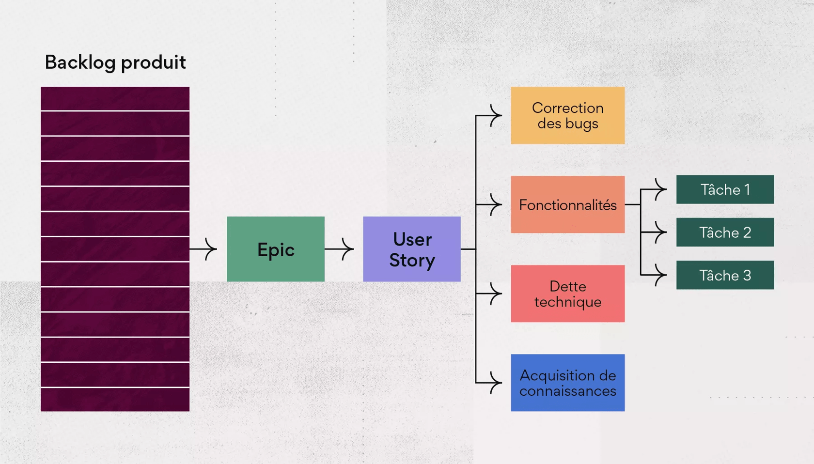

# Table of Contents

- [Table of Contents](#table-of-contents)
- [Agile Manifest and Project Management](#agile-manifest-and-project-management)
- [Agile Manifesto and Project Management](#agile-manifesto-and-project-management)
- [The 4 Values of the Agile Method](#the-4-values-of-the-agile-method)
  - [Fundamental Principles of the Agile Method](#fundamental-principles-of-the-agile-method)
    - [Productivity](#productivity)
    - [Customer Communication](#customer-communication)
    - [Communication](#communication)
- [SCRUM](#scrum)
  - [Roles](#roles)
    - [Product Owner](#product-owner)
    - [Scrum Master](#scrum-master)
    - [Development Team](#development-team)
  - [The Product Backlog](#the-product-backlog)

# Agile Manifest and Project Management

Managing a project following the Agile manifesto places the **customer** at the center of the project's life cycle. By including the customer in the project setup process, the Agile team can adjust the project's development based on the evolving customer needs over time.

# Agile Manifesto and Project Management

Managing a project following the Agile manifesto places the **customer** at the center of the project's life cycle. By including the customer in the project setup process, the Agile team can adjust the project's development based on the evolving customer needs over time.

# The 4 Values of the Agile Method

- Team: **Individuals** and **interactions** over **processes** and **tools**.
- Application: **Operational features** over **comprehensive documentation**.
- Collaboration: **Collaboration with customers** over **contractual negotiation**.
- Adaptation: **Adaptability** to change over **following a rigid plan**.

## Fundamental Principles of the Agile Method

### Productivity

- Regularly deliver functional solutions.
- **Prioritize important tasks**.
- Segment project production.
- Maintain a strict guideline during project development.
- Embrace simplicity and the art of maximizing the amount of work **not done**.

### Customer Communication

- **The customer is part of the team**.
- Maintain **continuous communication** with the customer.
- Establish a **trustworthy relationship** with the customer.

### Communication

- Team adaptation and improvement.
- Prioritize human contact.
- **Human contact facilitates understanding of different stakeholder constraints**.
- Verbal and non-verbal communication (face-to-face communication).
- Self-responsibility of team members.

# SCRUM

SCRUM is a **framework** for implementing the Agile methodology **incrementally** and **iteratively**.

## Roles

### Product Owner

The **Product Owner** (PO) plays a critical role with a significant workload. They are responsible for **communication** between the **customer** and the **team**. The PO **organizes** the **Product Backlog** based on **task prioritization** and generally oversees the project's lifecycle.

### Scrum Master

The **SCRUM Master** is responsible for ensuring that the **SCRUM framework** is correctly implemented and is also in charge of **facilitating Agile rituals**.

### Development Team

The development team consists of **developers** who are responsible for **building project features**.

## The Product Backlog

The **Product Backlog** is a **registry** from which the team selects **tasks to be completed**. The Product Backlog is filled by the **Product Owner** and may contain :

- **User Stories**: User stories are **simple tasks** explaining a product feature. User stories can be broken down into **sub-tasks** that serve as **steps toward completing the related user story**. User stories are formatted as "**As a..., I can..., so that...**" or "**As a..., I must..., so that...**." For example, "As a learner, I must log in to participate in my class." This way, developers know what they need to do for the feature. User stories answer **`Who ? What ? Why ?`**, and it's up to the **developer** to answer **`How ?`**.

- **Epics**: Epics are a **group of user stories**. Generally, epics represent a complete feature, whereas **user stories** represent **fragment of feature**. An epic might be `User Authentication` and could contain the user story in the example above.

