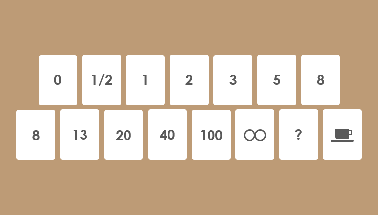
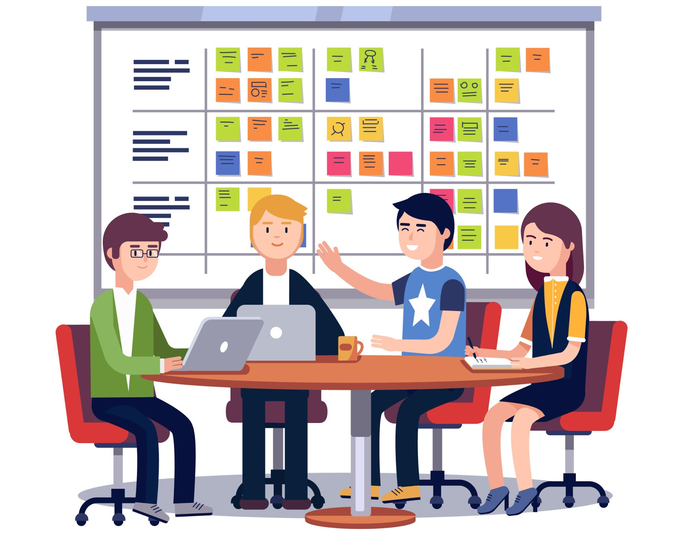

## Tables des matières

- [Qu'est ce que le Planning Poker ?](#quest-ce-que-le-planning-poker-)
- [Comment se déroule un Planning Poker](#comment-se-déroule-un-planning-poker)
- [Les avantages](#les-avantages)
- [Qui inclure dans les réunions de planification du poker ?](#qui-inclure-dans-les-réunions-de-planification-du-poker-)
- [Quand organiser une session de poker de planification ?](#quand-organiser-une-session-de-poker-de-planification-)

# Qu'est ce que le Planning Poker ?

**La méthode Agile du planning poker consiste en une estimation de la difficulté des taches fondée sur un consensus.**

Le Planning Poker, également connu sous le nom de "SCRUM Poker" ou "pointing Poker", est une technique ludique que les équipes de développement utilisent pour estimer l'effort des tâches de gestion de projet.
Ces estimations sont basées sur l'apport et un consensus de l'ensemble du groupe, ce qui rend ces dernières plus précises que d'autres méthodes.
Pour aider à évaluer le nombre de story points pour les tâches pertinentes, les équipes utilisent des cartes de poker de planification.

La suite de Fibonacci est utilisée pour les évaluations.
Comme nous cherchons à quantifier l'effort, le message est clair : plus le scénario est gros, moins l'évaluation est précise.
Le paquet de cartes utilisé pour le planning poker doit comporter les valeurs suivantes : 1, 2, 3, 5, 8, 13, 21, 34, 55, 89, 144.
Certains simplifient les grandes valeurs en les transformant en 20, 40, 100... puisqu'il s'agit d'être globalement bon plutôt que précisément erroné.
On y ajoute généralement les valeurs 0 et 1/2.

# Comment se déroule un Planning Poker

Au début d'une session du Planning Poker, le Product Owner ou le client examine une user story agile et la lit à haute voix.
Une user story est une explication générale et informelle d'une fonctionnalité logicielle qui décrit comment elle offrira de la valeur à l'utilisateur final (c'est-à-dire le client).

1. **Distribuez les cartes aux participants**

   Distribuez à chacun un jeu de cartes identique. Chacun porte un numéro dont l'équipe a convenu. Chaque joueur doit disposer d'un jeu composé de nombres différents. Mike Cohn recommande une séquence de 0, 1, 2, 3, 5, 8, 13, 20, 40 et 100 dans son livre "***Agile estimating and planning***".

   D'autres séquences courantes comprennent le doublement du nombre suivant (par exemple, 1, 2, 4, 8, etc.). Ces valeurs peuvent représenter un certain nombre de choses : le nombre de story points, de jours idéaux, ou d'autres unités que l'équipe utilise pour l'estimation.
   
   Les jeux de cartes sont intentionnellement maintenus à un niveau minimal avec des sauts de chiffres considérables. Cela permet de s'assurer que pour chaque story, tout le monde peut atteindre un nombre consensuel. S'il y avait une carte pour chaque chiffre de 1 à 50, le processus serait terriblement lent.

2. **Lisez la story à voix haute**

   Le modérateur (le Product Owner) raconte la story au groupe. Si les participants ont des questions, le modérateur y répond.

3. **Discutez de la story**

   Une fois que le groupe a fini d'écouter la story, chacun partage son point de vue sur celle-ci. Certains de ces points de discussion incluront probablement les questions :

   - Comment devons-nous gérer le travail ?
   - Combien de personnes sont censées s'impliquer ?
   - Quelles compétences seront nécessaires pour travailler sur la story ?
   - Comment s'attaquer aux obstacles qui retardent les progrès ?

   Le groupe essaiera également d'en savoir plus sur la story et de poser des questions pour mieux la comprendre.

4. **Sélectionner et partager**

   Après la discussion, chaque personne choisira en privé une carte du jeu. Habituellement, elle est utilisée pour montrer une estimation des points de la story (mais elle peut aussi être utilisée pour représenter le nombre de jours idéaux). Une fois que tout le monde a choisi une carte, ils les montrent en même temps.

   Si un joueur montre une carte supérieure, cela signifie que la story sera terminée avec plus de difficultés et plus de temps engagé. N'oubliez pas qu'il est courant que les estimations varient considérablement.

5. **Obtenir un consensus**

   Lorsque les membres de l'équipe montrent la même carte, ce nombre se transforme en un consensus. À ce moment là, le groupe peut aller de l'avant et travailler sur la prochaine story. Toutefois, si les cartes continuent à varier, d'autres discussions sur la story suivront.
   
   Les participants dont les estimations sont supérieures ou inférieures à celles des autres communiqueront leur point de vue. Puis, ils tenteront de convaincre leurs coéquipiers de comprendre leurs chiffres divergents.
   Une fois cette nouvelle délibération terminée, tout le monde passera en revue son jeu et le montrera à nouveau.
   
   Si un participant est toujours d'accord avec son dernier choix, il répétera la carte ou en choisira éventuellement une nouvelle. En général, les estimations commencent à converger après le deuxième tour. Si ce n'est pas le cas, le processus se répète jusqu'à ce que l'équipe se mette d'accord sur un chiffre unique.

# Les avantages

Selon une étude, les estimations issues du Planning Poker sont statistiquement plus élevées que les estimations individuelles.

- Les autres avantages sont les suivants :
  
  - Estimer les tâches les unes par rapport aux autres. Il est souvent difficile d'évaluer le temps nécessaire à la réalisation d'un projet, surtout lorsqu'il s'agit de la première fois.
  Le Planning Poker permet aux équipes de se familiariser avec leur évaluation. Après avoir joué le jeu pendant un certain temps, vous finissez par construire une série de tâches qui servent de référence future pour la comparaison.
  
  - Donner une voix égale à tous les membres de l'équipe. Il peut encourager les nouveaux employés à prendre la parole en jouant une carte et en expliquant leur logique. Par exemple, imaginez que vous faites une application de réservation de nourriture. Vous et votre collègue pourriez donner une estimation plus petite, comme 10 ou 15. En revanche, un nouvel employé pourrait donner une estimation de 100. Peut-être a-t-il eu l'expérience de la création d'une application similaire dans son dernier emploi et sait-il qu'une telle application prend beaucoup de temps, surtout par rapport aux autres.
  
  - Identifier les lacunes dans les exigences et la mise en œuvre. Lorsque les participants divulguent leurs estimations, ils doivent les étayer en expliquant pourquoi elles sont élevées ou faibles. Cela peut susciter des questions sur les exigences et la mise en œuvre - une boucle de rétroaction qui permet de détecter les lacunes.

# Qui inclure dans les réunions de planification du poker ?

Les bonnes personnes doivent se joindre à la réunion, sinon il devient difficile de récolter les avantages décrits ci-dessus. Ces rôles cruciaux sont les suivants :

- Membres de l'équipe Scrum : les membres de l'équipe Scrum fournissent les éléments du backlog de produit - une liste de produits à livrer (par exemple, les nouvelles fonctionnalités). Ils apportent également leur contribution aux discussions sur les story points.
- SCRUM Master : le SCRUM Master est l'animateur des réunions agiles. Il doit participer à toutes (ou presque toutes) les réunions.
- Product Owner : le PO décrira toutes les storys des utilisateurs à l'équipe et répondra à leurs questions.

# Quand organiser une session de poker de planification ?

En général, les équipes organisent une session après avoir créé le backlog initial. Bien que les sessions puissent parfois prendre plus d'une journée, elles permettent d'élaborer des estimations initiales utiles pour le dimensionnement ou la délimitation du projet.
Les éléments sont ajoutés au backlog du produit de manière incrémentielle tout au long de la durée de vie du projet. C'est pourquoi il est généralement plus pratique pour les équipes de mener des sessions une fois par itération. Dans la plupart des cas, cela se produit à quelques jours après la fin de l'itération. De même, il se produit aussi juste après un standup quotidien (un type de réunion agile) parce que toute l'équipe est présente.