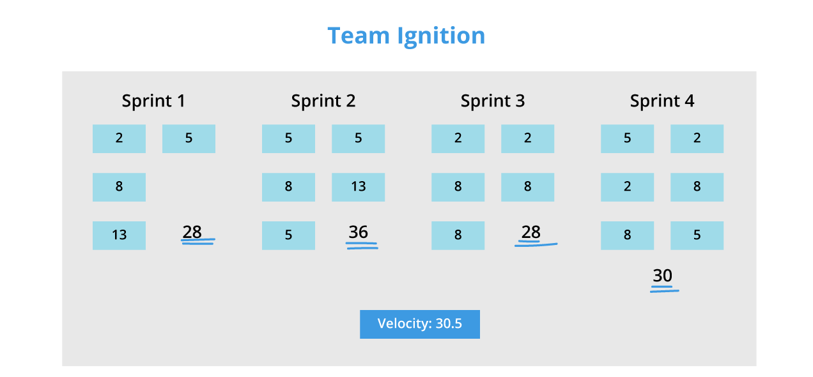

# Table of Contents

- [Table of Contents](#table-of-contents)
- [What is Velocity in the SCRUM Method?](#what-is-velocity-in-the-scrum-method)
- [Who Is Responsible for Estimating PBIs?](#who-is-responsible-for-estimating-pbis)

# What is Velocity in the SCRUM Method?

**Velocity** is an indicator used in projects managed using an agile method, for instance with the **SCRUM** framework. Agile velocity helps determine the effort an agile development team can provide for completing tasks scheduled within a sprint. It is expressed in terms of points.

The **Product Owner** places a certain number of features or items to be realized during the sprint in the **Product Backlog**, generally formalized as *user stories*. The development team assigns a certain number of points to each **Product Backlog Item (PBI)**. These points represent both the complexity and the estimated duration of completing the PBI empirically. It is not a linear scale; the Fibonacci suit is often used.

The values that can be assigned include:

- *1* for an extremely simple task, such as fixing a label, for example.
- *2, 3, 5* for a slightly more complex task, such as creating a simple input form.
- *8, 13, 21, 34, 55, 89, 144* if there is insufficient information to estimate the task correctly.

# Who Is Responsible for Estimating PBIs?

The **Product Owner** is responsible for providing the features or items to be completed during the sprint in the *Product Backlog*. During the planning session, the team must consider its capacity to determine the average velocity.

Only the development team is capable of estimating **PBIs**. They are responsible for distributing points empirically to each **PBI**. Once defined, velocity will be used to validate or revise the development plan.

It should be noted that the velocity in future iterations will be more or less equal to the previous one. For example, if *stories A* and *B* (each estimated at *2 points*) are 100% complete, and the output *C* (*3 points*) is only 80% complete, the iteration's velocity will be *4 points*.

Velocity can also be calculated by considering *story points*. *Story points* represent *user stories* and are a unit of measurement that indicates the effort required to complete a task. Generally, each organization has its method for assigning values to *story points*.

The velocity of a specific sprint is calculated by multiplying the number of completed *user stories* in the sprint by the *story points* assigned to each user story. For example: If you have completed *4 user stories*, and you assigned *3 story points* to each story, the total velocity for the sprint will be *4x3 = 12*.

You can average individual sprint velocities to obtain the average sprint velocity.