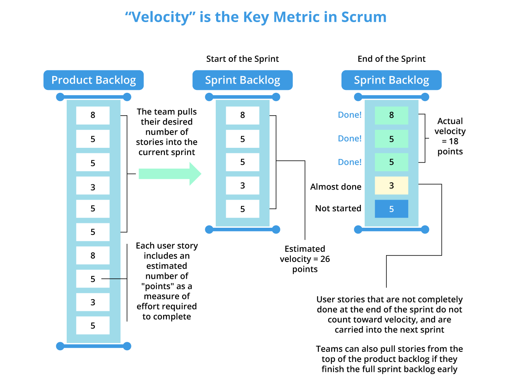

# Table of Contents

- [Table of Contents](#table-of-contents)
- [What is Velocity in the SCRUM Method?](#what-is-velocity-in-the-scrum-method)

# What is Velocity in the SCRUM Method?

**Velocity** is an indicator used in projects managed using an agile method, for instance with the **SCRUM** framework. Agile velocity helps determine the effort an agile development team can provide for completing tasks scheduled within a sprint. It is expressed in terms of points.

The **Product Owner** places a certain number of features or items to be realized during the sprint in the **Product Backlog**, generally formalized as *user stories*. The development team assigns a certain number of points to each **Product Backlog Item (PBI)**. These points represent both the complexity and the estimated duration of completing the PBI empirically. It is not a linear scale; the Fibonacci suit is often used.

The values that can be assigned include:

- *1* for an extremely simple task, such as fixing a label, for example.
- *2, 3, 5* for a slightly more complex task, such as creating a simple input form.
- *8, 13, 21, 34, 55, 89, 144* if there is insufficient information to estimate the task correctly.

