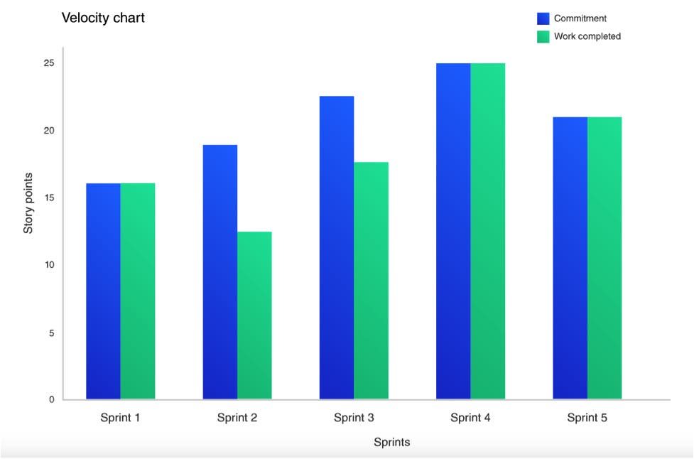

## Tables des matières

- [Qu'est ce que la Vélocité dans la méthode SCRUM](#quest-ce-que-la-vélocité-dans-la-méthode-scrum)
- [Qui se charge de l’estimation des PBIs ?](#qui-se-charge-de-lestimation-des-pbis-)
- [Comment utiliser la vélocité moyenne dans le développement agile ?](#comment-utiliser-la-vélocité-moyenne-dans-le-développement-agile-)
- [Tableau de vélocité agile](#tableau-de-vélocité-agile)
- [Quels sont les avantages de la mesure de la vélocité ?](#quels-sont-les-avantages-de-la-mesure-de-la-vélocité-)
- [Quels sont les inconvénients ?](#quels-sont-les-inconvénients-)
- [Conclusion](#conclusion)

# Qu'est ce que la Vélocité dans la méthode SCRUM

**La vélocité** est un indicateur utilisé sur des projets gérés à l'aide d'une méthode agile, par exemple avec le framework **SCRUM**. La vélocité agile permet de déterminer l'effort qu'est capable de fournir une équipe de développement pour la réalisation des tâches programmées dans un sprint. Elle est exprimée en nombre de points.

Le **Product Owner** place dans le **Product Backlog** un certain nombre de fonctionnalités à réaliser ou items généralement formalisés sous la forme d'*user stories*. L'équipe de développement attribue à chaque **Product Backlog Item (PBI)** un certain nombre de points. Ces points représentent à la fois la complexité et la durée de la réalisation du PBI estimée de façon empirique. Il ne s'agit pas d'une échelle linéaire. La suite de *Fibonacci* est souvent utilisée.

Aussi, les valeurs pouvant être attribuées sont :

- *1* pour une tâche extrêmement simple, comme la correction d'un libellé par exemple,
- *2, 3, 5* pour une tâche légèrement plus complexe, comme la création d'un formulaire de saisie simple,
- *8, 13, 21, 34, 55, 89, 144* si l'on ne dispose pas de suffisamment d'informations pour estimer correctement cette tâche.

# Qui se charge de l’estimation des PBIs ?

Le Product Owner a pour mission de donner à chaque product backlog les fonctionnalités ou items à réaliser durant le sprint. Lors de la session de planification, l’équipe doit prendre en compte sa capacité qui permettra de déterminer la vélocité moyenne.

Seule l’équipe de développement est en mesure de se charger de l’estimation des PBI. Elle se chargera de distribuer les points, estimés de manière empirique, à chaque PBI. Une fois définie, la vélocité servira à valider ou à réviser la planification du développement.

Notons que la vélocité durant les prochaines itérations sera plus ou moins égale à la précédente vélocité. À titre d’exemple, si les stories A et B (estimée chacune à 2 points) sont finies à 100 % et que la sortie C (3points) n’est achevée qu’à 80 %, la vélocité de l’itération sera de 4 points.

La vélocité peut également être calculée en considérant les story points. Les story points constituent les storys d'utilisateur et sont une unité de mesure qui représente la quantité d’effort nécessaire pour accomplir une tâche. En général, chaque organisation a sa propre méthode pour attribuer des valeurs aux story points.
La vélocité d'un sprint particulier est calculée en multipliant le nombre de story d'utilisateur achevés dans le sprint par le story point attribué à chaque histoire d'utilisateur. Par exemple : Si vous avez complété 4 user stories et que vous avez attribué 3 story points à chaque story, la vélocité totale du sprint sera de 4*3=12.
On peut faire la moyenne des vitesses de sprint individuelles pour obtenir la vitesse de sprint moyenne.

# Comment utiliser la vélocité moyenne dans le développement agile ?

Agile est synonyme de développement itératif, de solutions rapides et de mise sur le marché rapide des produits. Pour ce faire, les équipes Agiles doivent savoir quelle quantité de travail elles peuvent effectuer dans un sprint et combien de temps il leur faudra pour terminer le projet ou le livrer au client. Velocity les aide à prendre cette décision et à travailler efficacement.

La vélocité moyenne est calculée une fois que le projet a progressé à travers trois ou quatre sprints. La vélocité moyenne est calculée en faisant la moyenne des story points accumulés dans chaque sprint. Sur la base de cette vélocité moyenne calculée, les équipes peuvent se baser sur la quantité de travail qui reste à faire.
Si nous considérons l'exemple ci-dessus de la vitesse moyenne d'un sprint, nous pouvons supposer que l'équipe peut accomplir le travail à raison de 12 story points par sprint. Donc, s'il vous reste 120 story points à compléter dans votre projet, vous pouvez supposer que vous aurez besoin de 10 sprints supplémentaires pour terminer le projet.
Bien qu'elle soit précise, elle est sujette à des fluctuations en fonction de l'évolution des besoins, de la taille de l'équipe et de la complexité du projet.

# Tableau de vélocité agile

La méthode Agile présente plusieurs outils pour représenter visuellement les points de données. Ceux-ci constituent un indicateur facile de l'avancement du projet et, s'ils sont basés sur le cloud, ils peuvent être consultés par toutes les personnes impliquées dans le projet.
Les diagrammes de vélocité Agile sont essentiellement des graphiques, avec les story points affichés sur l'axe Y ou vertical et les sprints terminés affichés sur l'axe X ou vertical. Axe horizontal. Ils constituent un excellent moyen de rendre la vélocité de votre projet accessible à tous. Les graphiques basés sur le cloud peuvent être consultés par les équipes ainsi que par les parties prenantes.

Un diagramme de vélocité est un excellent moyen de suivre l'état d'avancement du projet, de voir si le projet progresse de manière régulière et prévisible et d'identifier des modèles dans la vélocité du sprint de l’équipe. S’il y a beaucoup de creux et d'élévations irrégulières dans vos graphiques, vous pouvez supposer que votre projet est imprévisible, car la vélocité n'est pas constante.

# Quels sont les avantages de la mesure de la vélocité ?

- Essentiel pour la planification des versions : La vélocité est indispensable à la planification des versions, car elle aide le product owner à déterminer combien de sprints seront nécessaires pour créer un produit ayant les fonctionnalités souhaitées. En obtenant une estimation du nombre de sprints nécessaires, le product owner peut estimez la date de sortie.
- Feedback pour l'équipe : La vélocité est un excellent outil pour mesurer les progrès de l'équipe. En suivant la vélocité dans le temps, les équipes peuvent mesurer si les changements qu'elles font pendant le sprint améliorent ou diminuent leur productivité. Alors que la vélocité peut fluctuer dans les nouvelles équipes, les équipes expérimentées ont une vélocité constante et peuvent mesurer leurs progrès grâce aux graphiques de vélocité.
- Prévision : La vélocité aide l'équipe à identifier le nombre de récits d'utilisateurs qu'elle peut réaliser dans un sprint. La prévision est un outil important qui aide les équipes à décider des délais et des budgets pour le projet.
  La prévision se fait généralement en prenant la moyenne de la vélocité des trois derniers sprints.

# Quels sont les inconvénients ?

Mesurer les progrès sur la base de la vélocité :

Si la vélocité est un excellent outil pour mesurer la progression de l'équipe, il ne faut pas oublier qu'il s'agit d'une mesure empirique, ce qui signifie qu'elle peut être utilisée pour l'estimation, mais pas comme norme finale pour mesurer la progression de l'équipe. La vélocité est souvent basée sur les story points, qui sont subjectifs pour l'équipe. Les équipes peuvent avoir leurs propres valeurs de points de story pour les storys d'utilisateur et donc définir leur propre vélocité et portée du travail. La vélocité est ainsi une variable changeante qui ne doit pas être utilisée comme critère de mesure de la progression de l'équipe.

- Problèmes de démarrage :
  La vélocité est mieux estimée par les équipes Scrum matures et bien rodées. Les équipes nouvelles ou en transition et les équipes qui se lancent dans de nouveaux projets auront besoin d'un certain temps pour devenir une machine bien huilée et obtenir une vélocité précise.

- Des tâches importantes :
  Scrum/Agile fonctionne sur le principe de la décomposition de grands projets en 
  petits morceaux et d'un produit livrable à la fin de chaque morceau. Un projet Scrum est généralement décomposé en épopées, sprints, user stories et tâches. Si les épopées ne sont pas suffisamment décomposées, cela aura un impact direct sur la vélocité et les équipes peuvent voir une forte baisse de vélocité d'un sprint à l'autre. Cela rend la vélocité moins prévisible.

- Le temps d'inactivité n'est pas comptabilisé :
  Un sprint ne se limite pas à la livraison ou à la production. Il y a beaucoup de choses qui se passent entre les deux, comme l'échange de courriels, les réunions de stand up, etc. Si ces éléments ne sont pas pris en compte dans la durée du sprint, la vélocité risque de faiblir.

# Conclusion

La vélocité est une mesure importante utilisée par les Scrum Masters et les Product Owners pour suivre les progrès de leur équipe et assurer la réussite du projet. La réponse rapide, la livraison rapide, le cadre incrémentiel et itératif d'Agile garantissent des versions rapides, des produits de qualité et la satisfaction du client.
La vélocité aide à déterminer les délais du projet et permet aux propriétaires de produits de donner des estimations précises sans tomber dans le piège du sur engagement.